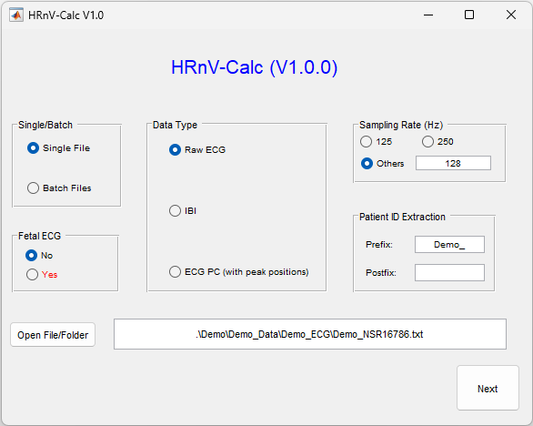

# HRnV-Calc: Software for Heart Rate n-Variability Analysis


 - **[HRnV-Calc Introduction](#hrnv-calc-introduction)**
      - [Description](#description)
      - [Installation](#installation)
      - [Citation](#citation)
      - [Contact](#contact)
- **[HRnV/HRV Methods and Metrics](#hrnvhrv-methods-and-metrics)**
  - [Methods and Metrics Documentation](#methods-and-metrics-documentations) 
- **[HRnV-Calc Tutorial](#hrnv-calc-tutorial)**
  - [Data Loader](#data-loader)
  - [QRS Detection & Edits viewer](#qrs-detection-and-edits-qde-viewer)
  - [HR<sub>n</sub>V<sub>m</sub>   Setting viewer](#hr_nv_m-setting-viewer)
  - [HR<sub>n</sub>V<sub>m</sub>  Results Display](#hrsubnsubvsubmsub-results-display)


## HRnV-Calc Introduction
### Description
The HRnV-Calc software is a heart rate variability (HRV) analysis software with the novel [HRnV method](https://bmccardiovascdisord.biomedcentral.com/articles/10.1186/s12872-020-01455-8) built in. The software is built upon the core HRV analysis code provided by [PhysioNet Cardiovascular Signal Toolbox (PCST)](https://physionet.org/content/pcst/1.0.0/). In addition to the fully automated command-line HRV analysis process provided by PCST, HRnV-Calc offers the HRnV metrics to augment insights discovered by HRV as well as intuitive graphical user interfaces (GUIs) for every major step of HRV and HRnV analysis. 

### Installation
The HRnV-Calc software is available freely on GitHub under the [GNU GPL (v3 or later)](https://www.gnu.org/licenses/gpl-3.0.en.html) license. 

To begin, please download and install [Matlab](https://www.mathworks.com/) (2017b or higher) (required Matlab Toolboxes: Signal Processing Toolbox, Statistics and Machine Learning Toolbox, Neural Network Toolbox, and Image Processing Toolbox)

Before using the GUIs and HRnV analysis provided by HRnV-Calc, users need to install PCST for the core signal analysis and HRV toolkits that HRnV-Calc depends on. Users may use the installation script – [‘Install_Dependency.m’](Install_Dependency.m) included in HRnV-Calc to automatically download and install PCST. 

Alternatively, PCST can be manually downloaded from [PhysioNet](https://physionet.org/content/pcst/1.0.0/PhysioNet-Cardiovascular-Signal-Toolbox.zip) and added to the directory containing HRnV-Calc code as a subdirectory. Do note that the name of the folder containing PCST should not be changed, as HRnV-Calc will check the existence of the original PCST folder before the software starts. 

### Citation
If you are using HRnV-Calc, please cite PCST and other related papers:

```
[1] Vest, A. N., Da Poian, G., Li, Q., Liu, C., Nemati, S., Shah, A. J., & Clifford, G. D. (2018). 
    An open source benchmarked toolbox for cardiovascular waveform and interval analysis. 
    Physiological measurement, 39(10), 105004. https://doi.org/10.1088/1361-6579/aae021

[2] Liu, N., Guo, D., Koh, Z. X., Ho, A., Xie, F., Tagami, T., Sakamoto, J. T., 
    Pek, P. P., Chakraborty, B., Lim, S. H., Tan, J., & Ong, M. (2020).
    Heart rate n-variability (HRnV) and its application to risk stratification of chest pain patients in the emergency department. 
    BMC cardiovascular disorders, 20(1), 168. https://doi.org/10.1186/s12872-020-01455-8
 
```  
### Contact
- Dagang Guo (Email: <guo.dagang@duke-nus.edu.sg>)
- Chenglin Niu (Email: <chenglin.niu@u.duke.nus.edu>)
- Nan Liu (Email: <liu.nan@duke-nus.edu.sg>)

## HRnV/HRV Methods and Metrics 
### HRnV Method
To use HRnV-Calc, it is important to know how the HRnV method. Here, we will give a simple explaination of the method.

HRnV is a method applied on RRI. Therefore, the extraction of RRI from ECG for HRnV is exactly the same as conventional HRV. Once the original RRI obtained, HRnV will generate new intervals called RR<sub>n</sub>I<sub>m</sub>, which is similar to RRI. 

There are two parameters to be specified for the HRnV method: the summation parameter *n* and the stride parameter *m*. Both *n* and *m* can take any positive integer (i.e., *n, m* >=1) given that (*m*<=*n*). To fully describe the process of RR<sub>n</sub>I<sub>m</sub>, consider a series clean RRI (i.e., all outliers and non-sinus beats are removed or processed), of lenght *N*. With specified *n* and *m*, the RR<sub>n</sub>I<sub>m</sub> generated from the input RRI,  of length *M* can be expressed as:
<p align = "center">

</p>

The length of the new series, *M*, is given by , where  represents the floor function. The figure below illustrates a toy example of generating RR<sub>3</sub>I<sub>2</sub> from a RRI series of lenght 9. 
<p align = "center">
<img src="data:image/svg+xml;base64,PHN2ZyB4bWxucz0iaHR0cDovL3d3dy53My5vcmcvMjAwMC9zdmciIHhtbG5zOnhsaW5rPSJodHRwOi8vd3d3LnczLm9yZy8xOTk5L3hsaW5rIiB2ZXJzaW9uPSIxLjEiIHdpZHRoPSI2NzNweCIgaGVpZ2h0PSIzMjFweCIgdmlld0JveD0iLTAuNSAtMC41IDY3MyAzMjEiPjxkZWZzLz48Zz48cmVjdCB4PSIxMzAiIHk9IjMwIiB3aWR0aD0iNjAiIGhlaWdodD0iNjAiIGZpbGw9IiNmZmZmZmYiIHN0cm9rZT0iIzAwMDAwMCIgcG9pbnRlci1ldmVudHM9ImFsbCIvPjxnIHRyYW5zZm9ybT0idHJhbnNsYXRlKC0wLjUgLTAuNSkiPjxzd2l0Y2g+PGZvcmVpZ25PYmplY3Qgc3R5bGU9Im92ZXJmbG93OiB2aXNpYmxlOyB0ZXh0LWFsaWduOiBsZWZ0OyIgcG9pbnRlci1ldmVudHM9Im5vbmUiIHdpZHRoPSIxMDAlIiBoZWlnaHQ9IjEwMCUiIHJlcXVpcmVkRmVhdHVyZXM9Imh0dHA6Ly93d3cudzMub3JnL1RSL1NWRzExL2ZlYXR1cmUjRXh0ZW5zaWJpbGl0eSI+PGRpdiB4bWxucz0iaHR0cDovL3d3dy53My5vcmcvMTk5OS94aHRtbCIgc3R5bGU9ImRpc3BsYXk6IGZsZXg7IGFsaWduLWl0ZW1zOiB1bnNhZmUgY2VudGVyOyBqdXN0aWZ5LWNvbnRlbnQ6IHVuc2FmZSBjZW50ZXI7IHdpZHRoOiA1OHB4OyBoZWlnaHQ6IDFweDsgcGFkZGluZy10b3A6IDYwcHg7IG1hcmdpbi1sZWZ0OiAxMzFweDsiPjxkaXYgc3R5bGU9ImJveC1zaXppbmc6IGJvcmRlci1ib3g7IGZvbnQtc2l6ZTogMDsgdGV4dC1hbGlnbjogY2VudGVyOyAiPjxkaXYgc3R5bGU9ImRpc3BsYXk6IGlubGluZS1ibG9jazsgZm9udC1zaXplOiAxMnB4OyBmb250LWZhbWlseTogSGVsdmV0aWNhOyBjb2xvcjogIzAwMDAwMDsgbGluZS1oZWlnaHQ6IDEuMjsgcG9pbnRlci1ldmVudHM6IGFsbDsgd2hpdGUtc3BhY2U6IG5vcm1hbDsgd29yZC13cmFwOiBub3JtYWw7ICI+PGZvbnQgc3R5bGU9ImZvbnQtc2l6ZTogMTRweCI+MC42PC9mb250PjwvZGl2PjwvZGl2PjwvZGl2PjwvZm9yZWlnbk9iamVjdD48dGV4dCB4PSIxNjAiIHk9IjY0IiBmaWxsPSIjMDAwMDAwIiBmb250LWZhbWlseT0iSGVsdmV0aWNhIiBmb250LXNpemU9IjEycHgiIHRleHQtYW5jaG9yPSJtaWRkbGUiPjAuNjwvdGV4dD48L3N3aXRjaD48L2c+PHJlY3QgeD0iMTkwIiB5PSIzMCIgd2lkdGg9IjYwIiBoZWlnaHQ9IjYwIiBmaWxsPSIjZmZmZmZmIiBzdHJva2U9IiMwMDAwMDAiIHBvaW50ZXItZXZlbnRzPSJhbGwiLz48ZyB0cmFuc2Zvcm09InRyYW5zbGF0ZSgtMC41IC0wLjUpIj48c3dpdGNoPjxmb3JlaWduT2JqZWN0IHN0eWxlPSJvdmVyZmxvdzogdmlzaWJsZTsgdGV4dC1hbGlnbjogbGVmdDsiIHBvaW50ZXItZXZlbnRzPSJub25lIiB3aWR0aD0iMTAwJSIgaGVpZ2h0PSIxMDAlIiByZXF1aXJlZEZlYXR1cmVzPSJodHRwOi8vd3d3LnczLm9yZy9UUi9TVkcxMS9mZWF0dXJlI0V4dGVuc2liaWxpdHkiPjxkaXYgeG1sbnM9Imh0dHA6Ly93d3cudzMub3JnLzE5OTkveGh0bWwiIHN0eWxlPSJkaXNwbGF5OiBmbGV4OyBhbGlnbi1pdGVtczogdW5zYWZlIGNlbnRlcjsganVzdGlmeS1jb250ZW50OiB1bnNhZmUgY2VudGVyOyB3aWR0aDogNThweDsgaGVpZ2h0OiAxcHg7IHBhZGRpbmctdG9wOiA2MHB4OyBtYXJnaW4tbGVmdDogMTkxcHg7Ij48ZGl2IHN0eWxlPSJib3gtc2l6aW5nOiBib3JkZXItYm94OyBmb250LXNpemU6IDA7IHRleHQtYWxpZ246IGNlbnRlcjsgIj48ZGl2IHN0eWxlPSJkaXNwbGF5OiBpbmxpbmUtYmxvY2s7IGZvbnQtc2l6ZTogMTJweDsgZm9udC1mYW1pbHk6IEhlbHZldGljYTsgY29sb3I6ICMwMDAwMDA7IGxpbmUtaGVpZ2h0OiAxLjI7IHBvaW50ZXItZXZlbnRzOiBhbGw7IHdoaXRlLXNwYWNlOiBub3JtYWw7IHdvcmQtd3JhcDogbm9ybWFsOyAiPjxmb250IHN0eWxlPSJmb250LXNpemU6IDE0cHgiPjAuNTwvZm9udD48L2Rpdj48L2Rpdj48L2Rpdj48L2ZvcmVpZ25PYmplY3Q+PHRleHQgeD0iMjIwIiB5PSI2NCIgZmlsbD0iIzAwMDAwMCIgZm9udC1mYW1pbHk9IkhlbHZldGljYSIgZm9udC1zaXplPSIxMnB4IiB0ZXh0LWFuY2hvcj0ibWlkZGxlIj4wLjU8L3RleHQ+PC9zd2l0Y2g+PC9nPjxyZWN0IHg9IjI1MCIgeT0iMzAiIHdpZHRoPSI2MCIgaGVpZ2h0PSI2MCIgZmlsbD0iI2ZmZmZmZiIgc3Ryb2tlPSIjMDAwMDAwIiBwb2ludGVyLWV2ZW50cz0iYWxsIi8+PGcgdHJhbnNmb3JtPSJ0cmFuc2xhdGUoLTAuNSAtMC41KSI+PHN3aXRjaD48Zm9yZWlnbk9iamVjdCBzdHlsZT0ib3ZlcmZsb3c6IHZpc2libGU7IHRleHQtYWxpZ246IGxlZnQ7IiBwb2ludGVyLWV2ZW50cz0ibm9uZSIgd2lkdGg9IjEwMCUiIGhlaWdodD0iMTAwJSIgcmVxdWlyZWRGZWF0dXJlcz0iaHR0cDovL3d3dy53My5vcmcvVFIvU1ZHMTEvZmVhdHVyZSNFeHRlbnNpYmlsaXR5Ij48ZGl2IHhtbG5zPSJodHRwOi8vd3d3LnczLm9yZy8xOTk5L3hodG1sIiBzdHlsZT0iZGlzcGxheTogZmxleDsgYWxpZ24taXRlbXM6IHVuc2FmZSBjZW50ZXI7IGp1c3RpZnktY29udGVudDogdW5zYWZlIGNlbnRlcjsgd2lkdGg6IDU4cHg7IGhlaWdodDogMXB4OyBwYWRkaW5nLXRvcDogNjBweDsgbWFyZ2luLWxlZnQ6IDI1MXB4OyI+PGRpdiBzdHlsZT0iYm94LXNpemluZzogYm9yZGVyLWJveDsgZm9udC1zaXplOiAwOyB0ZXh0LWFsaWduOiBjZW50ZXI7ICI+PGRpdiBzdHlsZT0iZGlzcGxheTogaW5saW5lLWJsb2NrOyBmb250LXNpemU6IDEycHg7IGZvbnQtZmFtaWx5OiBIZWx2ZXRpY2E7IGNvbG9yOiAjMDAwMDAwOyBsaW5lLWhlaWdodDogMS4yOyBwb2ludGVyLWV2ZW50czogYWxsOyB3aGl0ZS1zcGFjZTogbm9ybWFsOyB3b3JkLXdyYXA6IG5vcm1hbDsgIj48Zm9udCBzdHlsZT0iZm9udC1zaXplOiAxNHB4Ij4wLjc8L2ZvbnQ+PC9kaXY+PC9kaXY+PC9kaXY+PC9mb3JlaWduT2JqZWN0Pjx0ZXh0IHg9IjI4MCIgeT0iNjQiIGZpbGw9IiMwMDAwMDAiIGZvbnQtZmFtaWx5PSJIZWx2ZXRpY2EiIGZvbnQtc2l6ZT0iMTJweCIgdGV4dC1hbmNob3I9Im1pZGRsZSI+MC43PC90ZXh0Pjwvc3dpdGNoPjwvZz48cmVjdCB4PSIzMTAiIHk9IjMwIiB3aWR0aD0iNjAiIGhlaWdodD0iNjAiIGZpbGw9IiNmZmZmZmYiIHN0cm9rZT0iIzAwMDAwMCIgcG9pbnRlci1ldmVudHM9ImFsbCIvPjxnIHRyYW5zZm9ybT0idHJhbnNsYXRlKC0wLjUgLTAuNSkiPjxzd2l0Y2g+PGZvcmVpZ25PYmplY3Qgc3R5bGU9Im92ZXJmbG93OiB2aXNpYmxlOyB0ZXh0LWFsaWduOiBsZWZ0OyIgcG9pbnRlci1ldmVudHM9Im5vbmUiIHdpZHRoPSIxMDAlIiBoZWlnaHQ9IjEwMCUiIHJlcXVpcmVkRmVhdHVyZXM9Imh0dHA6Ly93d3cudzMub3JnL1RSL1NWRzExL2ZlYXR1cmUjRXh0ZW5zaWJpbGl0eSI+PGRpdiB4bWxucz0iaHR0cDovL3d3dy53My5vcmcvMTk5OS94aHRtbCIgc3R5bGU9ImRpc3BsYXk6IGZsZXg7IGFsaWduLWl0ZW1zOiB1bnNhZmUgY2VudGVyOyBqdXN0aWZ5LWNvbnRlbnQ6IHVuc2FmZSBjZW50ZXI7IHdpZHRoOiA1OHB4OyBoZWlnaHQ6IDFweDsgcGFkZGluZy10b3A6IDYwcHg7IG1hcmdpbi1sZWZ0OiAzMTFweDsiPjxkaXYgc3R5bGU9ImJveC1zaXppbmc6IGJvcmRlci1ib3g7IGZvbnQtc2l6ZTogMDsgdGV4dC1hbGlnbjogY2VudGVyOyAiPjxkaXYgc3R5bGU9ImRpc3BsYXk6IGlubGluZS1ibG9jazsgZm9udC1zaXplOiAxMnB4OyBmb250LWZhbWlseTogSGVsdmV0aWNhOyBjb2xvcjogIzAwMDAwMDsgbGluZS1oZWlnaHQ6IDEuMjsgcG9pbnRlci1ldmVudHM6IGFsbDsgd2hpdGUtc3BhY2U6IG5vcm1hbDsgd29yZC13cmFwOiBub3JtYWw7ICI+PGZvbnQgc3R5bGU9ImZvbnQtc2l6ZTogMTRweCI+MC42PC9mb250PjwvZGl2PjwvZGl2PjwvZGl2PjwvZm9yZWlnbk9iamVjdD48dGV4dCB4PSIzNDAiIHk9IjY0IiBmaWxsPSIjMDAwMDAwIiBmb250LWZhbWlseT0iSGVsdmV0aWNhIiBmb250LXNpemU9IjEycHgiIHRleHQtYW5jaG9yPSJtaWRkbGUiPjAuNjwvdGV4dD48L3N3aXRjaD48L2c+PHJlY3QgeD0iMzcwIiB5PSIzMCIgd2lkdGg9IjYwIiBoZWlnaHQ9IjYwIiBmaWxsPSIjZmZmZmZmIiBzdHJva2U9IiMwMDAwMDAiIHBvaW50ZXItZXZlbnRzPSJhbGwiLz48ZyB0cmFuc2Zvcm09InRyYW5zbGF0ZSgtMC41IC0wLjUpIj48c3dpdGNoPjxmb3JlaWduT2JqZWN0IHN0eWxlPSJvdmVyZmxvdzogdmlzaWJsZTsgdGV4dC1hbGlnbjogbGVmdDsiIHBvaW50ZXItZXZlbnRzPSJub25lIiB3aWR0aD0iMTAwJSIgaGVpZ2h0PSIxMDAlIiByZXF1aXJlZEZlYXR1cmVzPSJodHRwOi8vd3d3LnczLm9yZy9UUi9TVkcxMS9mZWF0dXJlI0V4dGVuc2liaWxpdHkiPjxkaXYgeG1sbnM9Imh0dHA6Ly93d3cudzMub3JnLzE5OTkveGh0bWwiIHN0eWxlPSJkaXNwbGF5OiBmbGV4OyBhbGlnbi1pdGVtczogdW5zYWZlIGNlbnRlcjsganVzdGlmeS1jb250ZW50OiB1bnNhZmUgY2VudGVyOyB3aWR0aDogNThweDsgaGVpZ2h0OiAxcHg7IHBhZGRpbmctdG9wOiA2MHB4OyBtYXJnaW4tbGVmdDogMzcxcHg7Ij48ZGl2IHN0eWxlPSJib3gtc2l6aW5nOiBib3JkZXItYm94OyBmb250LXNpemU6IDA7IHRleHQtYWxpZ246IGNlbnRlcjsgIj48ZGl2IHN0eWxlPSJkaXNwbGF5OiBpbmxpbmUtYmxvY2s7IGZvbnQtc2l6ZTogMTJweDsgZm9udC1mYW1pbHk6IEhlbHZldGljYTsgY29sb3I6ICMwMDAwMDA7IGxpbmUtaGVpZ2h0OiAxLjI7IHBvaW50ZXItZXZlbnRzOiBhbGw7IHdoaXRlLXNwYWNlOiBub3JtYWw7IHdvcmQtd3JhcDogbm9ybWFsOyAiPjxmb250IHN0eWxlPSJmb250LXNpemU6IDE0cHgiPjAuODwvZm9udD48L2Rpdj48L2Rpdj48L2Rpdj48L2ZvcmVpZ25PYmplY3Q+PHRleHQgeD0iNDAwIiB5PSI2NCIgZmlsbD0iIzAwMDAwMCIgZm9udC1mYW1pbHk9IkhlbHZldGljYSIgZm9udC1zaXplPSIxMnB4IiB0ZXh0LWFuY2hvcj0ibWlkZGxlIj4wLjg8L3RleHQ+PC9zd2l0Y2g+PC9nPjxyZWN0IHg9IjQzMCIgeT0iMzAiIHdpZHRoPSI2MCIgaGVpZ2h0PSI2MCIgZmlsbD0iI2ZmZmZmZiIgc3Ryb2tlPSIjMDAwMDAwIiBwb2ludGVyLWV2ZW50cz0iYWxsIi8+PGcgdHJhbnNmb3JtPSJ0cmFuc2xhdGUoLTAuNSAtMC41KSI+PHN3aXRjaD48Zm9yZWlnbk9iamVjdCBzdHlsZT0ib3ZlcmZsb3c6IHZpc2libGU7IHRleHQtYWxpZ246IGxlZnQ7IiBwb2ludGVyLWV2ZW50cz0ibm9uZSIgd2lkdGg9IjEwMCUiIGhlaWdodD0iMTAwJSIgcmVxdWlyZWRGZWF0dXJlcz0iaHR0cDovL3d3dy53My5vcmcvVFIvU1ZHMTEvZmVhdHVyZSNFeHRlbnNpYmlsaXR5Ij48ZGl2IHhtbG5zPSJodHRwOi8vd3d3LnczLm9yZy8xOTk5L3hodG1sIiBzdHlsZT0iZGlzcGxheTogZmxleDsgYWxpZ24taXRlbXM6IHVuc2FmZSBjZW50ZXI7IGp1c3RpZnktY29udGVudDogdW5zYWZlIGNlbnRlcjsgd2lkdGg6IDU4cHg7IGhlaWdodDogMXB4OyBwYWRkaW5nLXRvcDogNjBweDsgbWFyZ2luLWxlZnQ6IDQzMXB4OyI+PGRpdiBzdHlsZT0iYm94LXNpemluZzogYm9yZGVyLWJveDsgZm9udC1zaXplOiAwOyB0ZXh0LWFsaWduOiBjZW50ZXI7ICI+PGRpdiBzdHlsZT0iZGlzcGxheTogaW5saW5lLWJsb2NrOyBmb250LXNpemU6IDEycHg7IGZvbnQtZmFtaWx5OiBIZWx2ZXRpY2E7IGNvbG9yOiAjMDAwMDAwOyBsaW5lLWhlaWdodDogMS4yOyBwb2ludGVyLWV2ZW50czogYWxsOyB3aGl0ZS1zcGFjZTogbm9ybWFsOyB3b3JkLXdyYXA6IG5vcm1hbDsgIj48Zm9udCBzdHlsZT0iZm9udC1zaXplOiAxNHB4Ij4wLjY8L2ZvbnQ+PC9kaXY+PC9kaXY+PC9kaXY+PC9mb3JlaWduT2JqZWN0Pjx0ZXh0IHg9IjQ2MCIgeT0iNjQiIGZpbGw9IiMwMDAwMDAiIGZvbnQtZmFtaWx5PSJIZWx2ZXRpY2EiIGZvbnQtc2l6ZT0iMTJweCIgdGV4dC1hbmNob3I9Im1pZGRsZSI+MC42PC90ZXh0Pjwvc3dpdGNoPjwvZz48cmVjdCB4PSI0OTAiIHk9IjMwIiB3aWR0aD0iNjAiIGhlaWdodD0iNjAiIGZpbGw9IiNmZmZmZmYiIHN0cm9rZT0iIzAwMDAwMCIgcG9pbnRlci1ldmVudHM9ImFsbCIvPjxnIHRyYW5zZm9ybT0idHJhbnNsYXRlKC0wLjUgLTAuNSkiPjxzd2l0Y2g+PGZvcmVpZ25PYmplY3Qgc3R5bGU9Im92ZXJmbG93OiB2aXNpYmxlOyB0ZXh0LWFsaWduOiBsZWZ0OyIgcG9pbnRlci1ldmVudHM9Im5vbmUiIHdpZHRoPSIxMDAlIiBoZWlnaHQ9IjEwMCUiIHJlcXVpcmVkRmVhdHVyZXM9Imh0dHA6Ly93d3cudzMub3JnL1RSL1NWRzExL2ZlYXR1cmUjRXh0ZW5zaWJpbGl0eSI+PGRpdiB4bWxucz0iaHR0cDovL3d3dy53My5vcmcvMTk5OS94aHRtbCIgc3R5bGU9ImRpc3BsYXk6IGZsZXg7IGFsaWduLWl0ZW1zOiB1bnNhZmUgY2VudGVyOyBqdXN0aWZ5LWNvbnRlbnQ6IHVuc2FmZSBjZW50ZXI7IHdpZHRoOiA1OHB4OyBoZWlnaHQ6IDFweDsgcGFkZGluZy10b3A6IDYwcHg7IG1hcmdpbi1sZWZ0OiA0OTFweDsiPjxkaXYgc3R5bGU9ImJveC1zaXppbmc6IGJvcmRlci1ib3g7IGZvbnQtc2l6ZTogMDsgdGV4dC1hbGlnbjogY2VudGVyOyAiPjxkaXYgc3R5bGU9ImRpc3BsYXk6IGlubGluZS1ibG9jazsgZm9udC1zaXplOiAxMnB4OyBmb250LWZhbWlseTogSGVsdmV0aWNhOyBjb2xvcjogIzAwMDAwMDsgbGluZS1oZWlnaHQ6IDEuMjsgcG9pbnRlci1ldmVudHM6IGFsbDsgd2hpdGUtc3BhY2U6IG5vcm1hbDsgd29yZC13cmFwOiBub3JtYWw7ICI+PGZvbnQgc3R5bGU9ImZvbnQtc2l6ZTogMTRweCI+MC42PC9mb250PjwvZGl2PjwvZGl2PjwvZGl2PjwvZm9yZWlnbk9iamVjdD48dGV4dCB4PSI1MjAiIHk9IjY0IiBmaWxsPSIjMDAwMDAwIiBmb250LWZhbWlseT0iSGVsdmV0aWNhIiBmb250LXNpemU9IjEycHgiIHRleHQtYW5jaG9yPSJtaWRkbGUiPjAuNjwvdGV4dD48L3N3aXRjaD48L2c+PHJlY3QgeD0iNTUwIiB5PSIzMCIgd2lkdGg9IjYwIiBoZWlnaHQ9IjYwIiBmaWxsPSIjZmZmZmZmIiBzdHJva2U9IiMwMDAwMDAiIHBvaW50ZXItZXZlbnRzPSJhbGwiLz48ZyB0cmFuc2Zvcm09InRyYW5zbGF0ZSgtMC41IC0wLjUpIj48c3dpdGNoPjxmb3JlaWduT2JqZWN0IHN0eWxlPSJvdmVyZmxvdzogdmlzaWJsZTsgdGV4dC1hbGlnbjogbGVmdDsiIHBvaW50ZXItZXZlbnRzPSJub25lIiB3aWR0aD0iMTAwJSIgaGVpZ2h0PSIxMDAlIiByZXF1aXJlZEZlYXR1cmVzPSJodHRwOi8vd3d3LnczLm9yZy9UUi9TVkcxMS9mZWF0dXJlI0V4dGVuc2liaWxpdHkiPjxkaXYgeG1sbnM9Imh0dHA6Ly93d3cudzMub3JnLzE5OTkveGh0bWwiIHN0eWxlPSJkaXNwbGF5OiBmbGV4OyBhbGlnbi1pdGVtczogdW5zYWZlIGNlbnRlcjsganVzdGlmeS1jb250ZW50OiB1bnNhZmUgY2VudGVyOyB3aWR0aDogNThweDsgaGVpZ2h0OiAxcHg7IHBhZGRpbmctdG9wOiA2MHB4OyBtYXJnaW4tbGVmdDogNTUxcHg7Ij48ZGl2IHN0eWxlPSJib3gtc2l6aW5nOiBib3JkZXItYm94OyBmb250LXNpemU6IDA7IHRleHQtYWxpZ246IGNlbnRlcjsgIj48ZGl2IHN0eWxlPSJkaXNwbGF5OiBpbmxpbmUtYmxvY2s7IGZvbnQtc2l6ZTogMTJweDsgZm9udC1mYW1pbHk6IEhlbHZldGljYTsgY29sb3I6ICMwMDAwMDA7IGxpbmUtaGVpZ2h0OiAxLjI7IHBvaW50ZXItZXZlbnRzOiBhbGw7IHdoaXRlLXNwYWNlOiBub3JtYWw7IHdvcmQtd3JhcDogbm9ybWFsOyAiPjxmb250IHN0eWxlPSJmb250LXNpemU6IDE0cHgiPjAuNzwvZm9udD48L2Rpdj48L2Rpdj48L2Rpdj48L2ZvcmVpZ25PYmplY3Q+PHRleHQgeD0iNTgwIiB5PSI2NCIgZmlsbD0iIzAwMDAwMCIgZm9udC1mYW1pbHk9IkhlbHZldGljYSIgZm9udC1zaXplPSIxMnB4IiB0ZXh0LWFuY2hvcj0ibWlkZGxlIj4wLjc8L3RleHQ+PC9zd2l0Y2g+PC9nPjxyZWN0IHg9IjYxMCIgeT0iMzAiIHdpZHRoPSI2MCIgaGVpZ2h0PSI2MCIgZmlsbD0iI2ZmZmZmZiIgc3Ryb2tlPSIjMDAwMDAwIiBwb2ludGVyLWV2ZW50cz0iYWxsIi8+PGcgdHJhbnNmb3JtPSJ0cmFuc2xhdGUoLTAuNSAtMC41KSI+PHN3aXRjaD48Zm9yZWlnbk9iamVjdCBzdHlsZT0ib3ZlcmZsb3c6IHZpc2libGU7IHRleHQtYWxpZ246IGxlZnQ7IiBwb2ludGVyLWV2ZW50cz0ibm9uZSIgd2lkdGg9IjEwMCUiIGhlaWdodD0iMTAwJSIgcmVxdWlyZWRGZWF0dXJlcz0iaHR0cDovL3d3dy53My5vcmcvVFIvU1ZHMTEvZmVhdHVyZSNFeHRlbnNpYmlsaXR5Ij48ZGl2IHhtbG5zPSJodHRwOi8vd3d3LnczLm9yZy8xOTk5L3hodG1sIiBzdHlsZT0iZGlzcGxheTogZmxleDsgYWxpZ24taXRlbXM6IHVuc2FmZSBjZW50ZXI7IGp1c3RpZnktY29udGVudDogdW5zYWZlIGNlbnRlcjsgd2lkdGg6IDU4cHg7IGhlaWdodDogMXB4OyBwYWRkaW5nLXRvcDogNjBweDsgbWFyZ2luLWxlZnQ6IDYxMXB4OyI+PGRpdiBzdHlsZT0iYm94LXNpemluZzogYm9yZGVyLWJveDsgZm9udC1zaXplOiAwOyB0ZXh0LWFsaWduOiBjZW50ZXI7ICI+PGRpdiBzdHlsZT0iZGlzcGxheTogaW5saW5lLWJsb2NrOyBmb250LXNpemU6IDEycHg7IGZvbnQtZmFtaWx5OiBIZWx2ZXRpY2E7IGNvbG9yOiAjMDAwMDAwOyBsaW5lLWhlaWdodDogMS4yOyBwb2ludGVyLWV2ZW50czogYWxsOyB3aGl0ZS1zcGFjZTogbm9ybWFsOyB3b3JkLXdyYXA6IG5vcm1hbDsgIj48Zm9udCBzdHlsZT0iZm9udC1zaXplOiAxNHB4Ij4wLjY8L2ZvbnQ+PC9kaXY+PC9kaXY+PC9kaXY+PC9mb3JlaWduT2JqZWN0Pjx0ZXh0IHg9IjY0MCIgeT0iNjQiIGZpbGw9IiMwMDAwMDAiIGZvbnQtZmFtaWx5PSJIZWx2ZXRpY2EiIGZvbnQtc2l6ZT0iMTJweCIgdGV4dC1hbmNob3I9Im1pZGRsZSI+MC42PC90ZXh0Pjwvc3dpdGNoPjwvZz48cmVjdCB4PSIxNDAiIHk9IjAiIHdpZHRoPSI0MCIgaGVpZ2h0PSIyMCIgZmlsbD0ibm9uZSIgc3Ryb2tlPSJub25lIiBwb2ludGVyLWV2ZW50cz0iYWxsIi8+PGcgdHJhbnNmb3JtPSJ0cmFuc2xhdGUoLTAuNSAtMC41KSI+PHN3aXRjaD48Zm9yZWlnbk9iamVjdCBzdHlsZT0ib3ZlcmZsb3c6IHZpc2libGU7IHRleHQtYWxpZ246IGxlZnQ7IiBwb2ludGVyLWV2ZW50cz0ibm9uZSIgd2lkdGg9IjEwMCUiIGhlaWdodD0iMTAwJSIgcmVxdWlyZWRGZWF0dXJlcz0iaHR0cDovL3d3dy53My5vcmcvVFIvU1ZHMTEvZmVhdHVyZSNFeHRlbnNpYmlsaXR5Ij48ZGl2IHhtbG5zPSJodHRwOi8vd3d3LnczLm9yZy8xOTk5L3hodG1sIiBzdHlsZT0iZGlzcGxheTogZmxleDsgYWxpZ24taXRlbXM6IHVuc2FmZSBjZW50ZXI7IGp1c3RpZnktY29udGVudDogdW5zYWZlIGNlbnRlcjsgd2lkdGg6IDM4cHg7IGhlaWdodDogMXB4OyBwYWRkaW5nLXRvcDogMTBweDsgbWFyZ2luLWxlZnQ6IDE0MXB4OyI+PGRpdiBzdHlsZT0iYm94LXNpemluZzogYm9yZGVyLWJveDsgZm9udC1zaXplOiAwOyB0ZXh0LWFsaWduOiBjZW50ZXI7ICI+PGRpdiBzdHlsZT0iZGlzcGxheTogaW5saW5lLWJsb2NrOyBmb250LXNpemU6IDEycHg7IGZvbnQtZmFtaWx5OiBIZWx2ZXRpY2E7IGNvbG9yOiAjMDAwMDAwOyBsaW5lLWhlaWdodDogMS4yOyBwb2ludGVyLWV2ZW50czogYWxsOyB3aGl0ZS1zcGFjZTogbm9ybWFsOyB3b3JkLXdyYXA6IG5vcm1hbDsgIj48Zm9udCBzdHlsZT0iZm9udC1zaXplOiAxNnB4Ij48Yj4xPC9iPjwvZm9udD48L2Rpdj48L2Rpdj48L2Rpdj48L2ZvcmVpZ25PYmplY3Q+PHRleHQgeD0iMTYwIiB5PSIxNCIgZmlsbD0iIzAwMDAwMCIgZm9udC1mYW1pbHk9IkhlbHZldGljYSIgZm9udC1zaXplPSIxMnB4IiB0ZXh0LWFuY2hvcj0ibWlkZGxlIj4xPC90ZXh0Pjwvc3dpdGNoPjwvZz48cmVjdCB4PSIyMDAiIHk9IjAiIHdpZHRoPSI0MCIgaGVpZ2h0PSIyMCIgZmlsbD0ibm9uZSIgc3Ryb2tlPSJub25lIiBwb2ludGVyLWV2ZW50cz0iYWxsIi8+PGcgdHJhbnNmb3JtPSJ0cmFuc2xhdGUoLTAuNSAtMC41KSI+PHN3aXRjaD48Zm9yZWlnbk9iamVjdCBzdHlsZT0ib3ZlcmZsb3c6IHZpc2libGU7IHRleHQtYWxpZ246IGxlZnQ7IiBwb2ludGVyLWV2ZW50cz0ibm9uZSIgd2lkdGg9IjEwMCUiIGhlaWdodD0iMTAwJSIgcmVxdWlyZWRGZWF0dXJlcz0iaHR0cDovL3d3dy53My5vcmcvVFIvU1ZHMTEvZmVhdHVyZSNFeHRlbnNpYmlsaXR5Ij48ZGl2IHhtbG5zPSJodHRwOi8vd3d3LnczLm9yZy8xOTk5L3hodG1sIiBzdHlsZT0iZGlzcGxheTogZmxleDsgYWxpZ24taXRlbXM6IHVuc2FmZSBjZW50ZXI7IGp1c3RpZnktY29udGVudDogdW5zYWZlIGNlbnRlcjsgd2lkdGg6IDM4cHg7IGhlaWdodDogMXB4OyBwYWRkaW5nLXRvcDogMTBweDsgbWFyZ2luLWxlZnQ6IDIwMXB4OyI+PGRpdiBzdHlsZT0iYm94LXNpemluZzogYm9yZGVyLWJveDsgZm9udC1zaXplOiAwOyB0ZXh0LWFsaWduOiBjZW50ZXI7ICI+PGRpdiBzdHlsZT0iZGlzcGxheTogaW5saW5lLWJsb2NrOyBmb250LXNpemU6IDEycHg7IGZvbnQtZmFtaWx5OiBIZWx2ZXRpY2E7IGNvbG9yOiAjMDAwMDAwOyBsaW5lLWhlaWdodDogMS4yOyBwb2ludGVyLWV2ZW50czogYWxsOyB3aGl0ZS1zcGFjZTogbm9ybWFsOyB3b3JkLXdyYXA6IG5vcm1hbDsgIj48Zm9udCBzdHlsZT0iZm9udC1zaXplOiAxNnB4Ij48Yj4yPC9iPjwvZm9udD48L2Rpdj48L2Rpdj48L2Rpdj48L2ZvcmVpZ25PYmplY3Q+PHRleHQgeD0iMjIwIiB5PSIxNCIgZmlsbD0iIzAwMDAwMCIgZm9udC1mYW1pbHk9IkhlbHZldGljYSIgZm9udC1zaXplPSIxMnB4IiB0ZXh0LWFuY2hvcj0ibWlkZGxlIj4yPC90ZXh0Pjwvc3dpdGNoPjwvZz48cmVjdCB4PSIyNjAiIHk9IjAiIHdpZHRoPSI0MCIgaGVpZ2h0PSIyMCIgZmlsbD0ibm9uZSIgc3Ryb2tlPSJub25lIiBwb2ludGVyLWV2ZW50cz0iYWxsIi8+PGcgdHJhbnNmb3JtPSJ0cmFuc2xhdGUoLTAuNSAtMC41KSI+PHN3aXRjaD48Zm9yZWlnbk9iamVjdCBzdHlsZT0ib3ZlcmZsb3c6IHZpc2libGU7IHRleHQtYWxpZ246IGxlZnQ7IiBwb2ludGVyLWV2ZW50cz0ibm9uZSIgd2lkdGg9IjEwMCUiIGhlaWdodD0iMTAwJSIgcmVxdWlyZWRGZWF0dXJlcz0iaHR0cDovL3d3dy53My5vcmcvVFIvU1ZHMTEvZmVhdHVyZSNFeHRlbnNpYmlsaXR5Ij48ZGl2IHhtbG5zPSJodHRwOi8vd3d3LnczLm9yZy8xOTk5L3hodG1sIiBzdHlsZT0iZGlzcGxheTogZmxleDsgYWxpZ24taXRlbXM6IHVuc2FmZSBjZW50ZXI7IGp1c3RpZnktY29udGVudDogdW5zYWZlIGNlbnRlcjsgd2lkdGg6IDM4cHg7IGhlaWdodDogMXB4OyBwYWRkaW5nLXRvcDogMTBweDsgbWFyZ2luLWxlZnQ6IDI2MXB4OyI+PGRpdiBzdHlsZT0iYm94LXNpemluZzogYm9yZGVyLWJveDsgZm9udC1zaXplOiAwOyB0ZXh0LWFsaWduOiBjZW50ZXI7ICI+PGRpdiBzdHlsZT0iZGlzcGxheTogaW5saW5lLWJsb2NrOyBmb250LXNpemU6IDEycHg7IGZvbnQtZmFtaWx5OiBIZWx2ZXRpY2E7IGNvbG9yOiAjMDAwMDAwOyBsaW5lLWhlaWdodDogMS4yOyBwb2ludGVyLWV2ZW50czogYWxsOyB3aGl0ZS1zcGFjZTogbm9ybWFsOyB3b3JkLXdyYXA6IG5vcm1hbDsgIj48c3BhbiBzdHlsZT0iZm9udC1zaXplOiAxNnB4Ij48Yj4zPC9iPjwvc3Bhbj48L2Rpdj48L2Rpdj48L2Rpdj48L2ZvcmVpZ25PYmplY3Q+PHRleHQgeD0iMjgwIiB5PSIxNCIgZmlsbD0iIzAwMDAwMCIgZm9udC1mYW1pbHk9IkhlbHZldGljYSIgZm9udC1zaXplPSIxMnB4IiB0ZXh0LWFuY2hvcj0ibWlkZGxlIj4zPC90ZXh0Pjwvc3dpdGNoPjwvZz48cmVjdCB4PSIzMjAiIHk9IjAiIHdpZHRoPSI0MCIgaGVpZ2h0PSIyMCIgZmlsbD0ibm9uZSIgc3Ryb2tlPSJub25lIiBwb2ludGVyLWV2ZW50cz0iYWxsIi8+PGcgdHJhbnNmb3JtPSJ0cmFuc2xhdGUoLTAuNSAtMC41KSI+PHN3aXRjaD48Zm9yZWlnbk9iamVjdCBzdHlsZT0ib3ZlcmZsb3c6IHZpc2libGU7IHRleHQtYWxpZ246IGxlZnQ7IiBwb2ludGVyLWV2ZW50cz0ibm9uZSIgd2lkdGg9IjEwMCUiIGhlaWdodD0iMTAwJSIgcmVxdWlyZWRGZWF0dXJlcz0iaHR0cDovL3d3dy53My5vcmcvVFIvU1ZHMTEvZmVhdHVyZSNFeHRlbnNpYmlsaXR5Ij48ZGl2IHhtbG5zPSJodHRwOi8vd3d3LnczLm9yZy8xOTk5L3hodG1sIiBzdHlsZT0iZGlzcGxheTogZmxleDsgYWxpZ24taXRlbXM6IHVuc2FmZSBjZW50ZXI7IGp1c3RpZnktY29udGVudDogdW5zYWZlIGNlbnRlcjsgd2lkdGg6IDM4cHg7IGhlaWdodDogMXB4OyBwYWRkaW5nLXRvcDogMTBweDsgbWFyZ2luLWxlZnQ6IDMyMXB4OyI+PGRpdiBzdHlsZT0iYm94LXNpemluZzogYm9yZGVyLWJveDsgZm9udC1zaXplOiAwOyB0ZXh0LWFsaWduOiBjZW50ZXI7ICI+PGRpdiBzdHlsZT0iZGlzcGxheTogaW5saW5lLWJsb2NrOyBmb250LXNpemU6IDEycHg7IGZvbnQtZmFtaWx5OiBIZWx2ZXRpY2E7IGNvbG9yOiAjMDAwMDAwOyBsaW5lLWhlaWdodDogMS4yOyBwb2ludGVyLWV2ZW50czogYWxsOyB3aGl0ZS1zcGFjZTogbm9ybWFsOyB3b3JkLXdyYXA6IG5vcm1hbDsgIj48Zm9udCBzdHlsZT0iZm9udC1zaXplOiAxNnB4Ij48Yj40PC9iPjwvZm9udD48L2Rpdj48L2Rpdj48L2Rpdj48L2ZvcmVpZ25PYmplY3Q+PHRleHQgeD0iMzQwIiB5PSIxNCIgZmlsbD0iIzAwMDAwMCIgZm9udC1mYW1pbHk9IkhlbHZldGljYSIgZm9udC1zaXplPSIxMnB4IiB0ZXh0LWFuY2hvcj0ibWlkZGxlIj40PC90ZXh0Pjwvc3dpdGNoPjwvZz48cmVjdCB4PSIzODAiIHk9IjAiIHdpZHRoPSI0MCIgaGVpZ2h0PSIyMCIgZmlsbD0ibm9uZSIgc3Ryb2tlPSJub25lIiBwb2ludGVyLWV2ZW50cz0iYWxsIi8+PGcgdHJhbnNmb3JtPSJ0cmFuc2xhdGUoLTAuNSAtMC41KSI+PHN3aXRjaD48Zm9yZWlnbk9iamVjdCBzdHlsZT0ib3ZlcmZsb3c6IHZpc2libGU7IHRleHQtYWxpZ246IGxlZnQ7IiBwb2ludGVyLWV2ZW50cz0ibm9uZSIgd2lkdGg9IjEwMCUiIGhlaWdodD0iMTAwJSIgcmVxdWlyZWRGZWF0dXJlcz0iaHR0cDovL3d3dy53My5vcmcvVFIvU1ZHMTEvZmVhdHVyZSNFeHRlbnNpYmlsaXR5Ij48ZGl2IHhtbG5zPSJodHRwOi8vd3d3LnczLm9yZy8xOTk5L3hodG1sIiBzdHlsZT0iZGlzcGxheTogZmxleDsgYWxpZ24taXRlbXM6IHVuc2FmZSBjZW50ZXI7IGp1c3RpZnktY29udGVudDogdW5zYWZlIGNlbnRlcjsgd2lkdGg6IDM4cHg7IGhlaWdodDogMXB4OyBwYWRkaW5nLXRvcDogMTBweDsgbWFyZ2luLWxlZnQ6IDM4MXB4OyI+PGRpdiBzdHlsZT0iYm94LXNpemluZzogYm9yZGVyLWJveDsgZm9udC1zaXplOiAwOyB0ZXh0LWFsaWduOiBjZW50ZXI7ICI+PGRpdiBzdHlsZT0iZGlzcGxheTogaW5saW5lLWJsb2NrOyBmb250LXNpemU6IDEycHg7IGZvbnQtZmFtaWx5OiBIZWx2ZXRpY2E7IGNvbG9yOiAjMDAwMDAwOyBsaW5lLWhlaWdodDogMS4yOyBwb2ludGVyLWV2ZW50czogYWxsOyB3aGl0ZS1zcGFjZTogbm9ybWFsOyB3b3JkLXdyYXA6IG5vcm1hbDsgIj48Zm9udCBzdHlsZT0iZm9udC1zaXplOiAxNnB4Ij48Yj41PC9iPjwvZm9udD48L2Rpdj48L2Rpdj48L2Rpdj48L2ZvcmVpZ25PYmplY3Q+PHRleHQgeD0iNDAwIiB5PSIxNCIgZmlsbD0iIzAwMDAwMCIgZm9udC1mYW1pbHk9IkhlbHZldGljYSIgZm9udC1zaXplPSIxMnB4IiB0ZXh0LWFuY2hvcj0ibWlkZGxlIj41PC90ZXh0Pjwvc3dpdGNoPjwvZz48cmVjdCB4PSI0NDAiIHk9IjAiIHdpZHRoPSI0MCIgaGVpZ2h0PSIyMCIgZmlsbD0ibm9uZSIgc3Ryb2tlPSJub25lIiBwb2ludGVyLWV2ZW50cz0iYWxsIi8+PGcgdHJhbnNmb3JtPSJ0cmFuc2xhdGUoLTAuNSAtMC41KSI+PHN3aXRjaD48Zm9yZWlnbk9iamVjdCBzdHlsZT0ib3ZlcmZsb3c6IHZpc2libGU7IHRleHQtYWxpZ246IGxlZnQ7IiBwb2ludGVyLWV2ZW50cz0ibm9uZSIgd2lkdGg9IjEwMCUiIGhlaWdodD0iMTAwJSIgcmVxdWlyZWRGZWF0dXJlcz0iaHR0cDovL3d3dy53My5vcmcvVFIvU1ZHMTEvZmVhdHVyZSNFeHRlbnNpYmlsaXR5Ij48ZGl2IHhtbG5zPSJodHRwOi8vd3d3LnczLm9yZy8xOTk5L3hodG1sIiBzdHlsZT0iZGlzcGxheTogZmxleDsgYWxpZ24taXRlbXM6IHVuc2FmZSBjZW50ZXI7IGp1c3RpZnktY29udGVudDogdW5zYWZlIGNlbnRlcjsgd2lkdGg6IDM4cHg7IGhlaWdodDogMXB4OyBwYWRkaW5nLXRvcDogMTBweDsgbWFyZ2luLWxlZnQ6IDQ0MXB4OyI+PGRpdiBzdHlsZT0iYm94LXNpemluZzogYm9yZGVyLWJveDsgZm9udC1zaXplOiAwOyB0ZXh0LWFsaWduOiBjZW50ZXI7ICI+PGRpdiBzdHlsZT0iZGlzcGxheTogaW5saW5lLWJsb2NrOyBmb250LXNpemU6IDEycHg7IGZvbnQtZmFtaWx5OiBIZWx2ZXRpY2E7IGNvbG9yOiAjMDAwMDAwOyBsaW5lLWhlaWdodDogMS4yOyBwb2ludGVyLWV2ZW50czogYWxsOyB3aGl0ZS1zcGFjZTogbm9ybWFsOyB3b3JkLXdyYXA6IG5vcm1hbDsgIj48Zm9udCBzdHlsZT0iZm9udC1zaXplOiAxNnB4Ij48Yj42PC9iPjwvZm9udD48L2Rpdj48L2Rpdj48L2Rpdj48L2ZvcmVpZ25PYmplY3Q+PHRleHQgeD0iNDYwIiB5PSIxNCIgZmlsbD0iIzAwMDAwMCIgZm9udC1mYW1pbHk9IkhlbHZldGljYSIgZm9udC1zaXplPSIxMnB4IiB0ZXh0LWFuY2hvcj0ibWlkZGxlIj42PC90ZXh0Pjwvc3dpdGNoPjwvZz48cmVjdCB4PSI1MDAiIHk9IjAiIHdpZHRoPSI0MCIgaGVpZ2h0PSIyMCIgZmlsbD0ibm9uZSIgc3Ryb2tlPSJub25lIiBwb2ludGVyLWV2ZW50cz0iYWxsIi8+PGcgdHJhbnNmb3JtPSJ0cmFuc2xhdGUoLTAuNSAtMC41KSI+PHN3aXRjaD48Zm9yZWlnbk9iamVjdCBzdHlsZT0ib3ZlcmZsb3c6IHZpc2libGU7IHRleHQtYWxpZ246IGxlZnQ7IiBwb2ludGVyLWV2ZW50cz0ibm9uZSIgd2lkdGg9IjEwMCUiIGhlaWdodD0iMTAwJSIgcmVxdWlyZWRGZWF0dXJlcz0iaHR0cDovL3d3dy53My5vcmcvVFIvU1ZHMTEvZmVhdHVyZSNFeHRlbnNpYmlsaXR5Ij48ZGl2IHhtbG5zPSJodHRwOi8vd3d3LnczLm9yZy8xOTk5L3hodG1sIiBzdHlsZT0iZGlzcGxheTogZmxleDsgYWxpZ24taXRlbXM6IHVuc2FmZSBjZW50ZXI7IGp1c3RpZnktY29udGVudDogdW5zYWZlIGNlbnRlcjsgd2lkdGg6IDM4cHg7IGhlaWdodDogMXB4OyBwYWRkaW5nLXRvcDogMTBweDsgbWFyZ2luLWxlZnQ6IDUwMXB4OyI+PGRpdiBzdHlsZT0iYm94LXNpemluZzogYm9yZGVyLWJveDsgZm9udC1zaXplOiAwOyB0ZXh0LWFsaWduOiBjZW50ZXI7ICI+PGRpdiBzdHlsZT0iZGlzcGxheTogaW5saW5lLWJsb2NrOyBmb250LXNpemU6IDEycHg7IGZvbnQtZmFtaWx5OiBIZWx2ZXRpY2E7IGNvbG9yOiAjMDAwMDAwOyBsaW5lLWhlaWdodDogMS4yOyBwb2ludGVyLWV2ZW50czogYWxsOyB3aGl0ZS1zcGFjZTogbm9ybWFsOyB3b3JkLXdyYXA6IG5vcm1hbDsgIj48Zm9udCBzdHlsZT0iZm9udC1zaXplOiAxNnB4Ij48Yj43PC9iPjwvZm9udD48L2Rpdj48L2Rpdj48L2Rpdj48L2ZvcmVpZ25PYmplY3Q+PHRleHQgeD0iNTIwIiB5PSIxNCIgZmlsbD0iIzAwMDAwMCIgZm9udC1mYW1pbHk9IkhlbHZldGljYSIgZm9udC1zaXplPSIxMnB4IiB0ZXh0LWFuY2hvcj0ibWlkZGxlIj43PC90ZXh0Pjwvc3dpdGNoPjwvZz48cmVjdCB4PSI1NjAiIHk9IjAiIHdpZHRoPSI0MCIgaGVpZ2h0PSIyMCIgZmlsbD0ibm9uZSIgc3Ryb2tlPSJub25lIiBwb2ludGVyLWV2ZW50cz0iYWxsIi8+PGcgdHJhbnNmb3JtPSJ0cmFuc2xhdGUoLTAuNSAtMC41KSI+PHN3aXRjaD48Zm9yZWlnbk9iamVjdCBzdHlsZT0ib3ZlcmZsb3c6IHZpc2libGU7IHRleHQtYWxpZ246IGxlZnQ7IiBwb2ludGVyLWV2ZW50cz0ibm9uZSIgd2lkdGg9IjEwMCUiIGhlaWdodD0iMTAwJSIgcmVxdWlyZWRGZWF0dXJlcz0iaHR0cDovL3d3dy53My5vcmcvVFIvU1ZHMTEvZmVhdHVyZSNFeHRlbnNpYmlsaXR5Ij48ZGl2IHhtbG5zPSJodHRwOi8vd3d3LnczLm9yZy8xOTk5L3hodG1sIiBzdHlsZT0iZGlzcGxheTogZmxleDsgYWxpZ24taXRlbXM6IHVuc2FmZSBjZW50ZXI7IGp1c3RpZnktY29udGVudDogdW5zYWZlIGNlbnRlcjsgd2lkdGg6IDM4cHg7IGhlaWdodDogMXB4OyBwYWRkaW5nLXRvcDogMTBweDsgbWFyZ2luLWxlZnQ6IDU2MXB4OyI+PGRpdiBzdHlsZT0iYm94LXNpemluZzogYm9yZGVyLWJveDsgZm9udC1zaXplOiAwOyB0ZXh0LWFsaWduOiBjZW50ZXI7ICI+PGRpdiBzdHlsZT0iZGlzcGxheTogaW5saW5lLWJsb2NrOyBmb250LXNpemU6IDEycHg7IGZvbnQtZmFtaWx5OiBIZWx2ZXRpY2E7IGNvbG9yOiAjMDAwMDAwOyBsaW5lLWhlaWdodDogMS4yOyBwb2ludGVyLWV2ZW50czogYWxsOyB3aGl0ZS1zcGFjZTogbm9ybWFsOyB3b3JkLXdyYXA6IG5vcm1hbDsgIj48Zm9udCBzdHlsZT0iZm9udC1zaXplOiAxNnB4Ij48Yj44PC9iPjwvZm9udD48L2Rpdj48L2Rpdj48L2Rpdj48L2ZvcmVpZ25PYmplY3Q+PHRleHQgeD0iNTgwIiB5PSIxNCIgZmlsbD0iIzAwMDAwMCIgZm9udC1mYW1pbHk9IkhlbHZldGljYSIgZm9udC1zaXplPSIxMnB4IiB0ZXh0LWFuY2hvcj0ibWlkZGxlIj44PC90ZXh0Pjwvc3dpdGNoPjwvZz48cmVjdCB4PSI2MjAiIHk9IjAiIHdpZHRoPSI0MCIgaGVpZ2h0PSIyMCIgZmlsbD0ibm9uZSIgc3Ryb2tlPSJub25lIiBwb2ludGVyLWV2ZW50cz0iYWxsIi8+PGcgdHJhbnNmb3JtPSJ0cmFuc2xhdGUoLTAuNSAtMC41KSI+PHN3aXRjaD48Zm9yZWlnbk9iamVjdCBzdHlsZT0ib3ZlcmZsb3c6IHZpc2libGU7IHRleHQtYWxpZ246IGxlZnQ7IiBwb2ludGVyLWV2ZW50cz0ibm9uZSIgd2lkdGg9IjEwMCUiIGhlaWdodD0iMTAwJSIgcmVxdWlyZWRGZWF0dXJlcz0iaHR0cDovL3d3dy53My5vcmcvVFIvU1ZHMTEvZmVhdHVyZSNFeHRlbnNpYmlsaXR5Ij48ZGl2IHhtbG5zPSJodHRwOi8vd3d3LnczLm9yZy8xOTk5L3hodG1sIiBzdHlsZT0iZGlzcGxheTogZmxleDsgYWxpZ24taXRlbXM6IHVuc2FmZSBjZW50ZXI7IGp1c3RpZnktY29udGVudDogdW5zYWZlIGNlbnRlcjsgd2lkdGg6IDM4cHg7IGhlaWdodDogMXB4OyBwYWRkaW5nLXRvcDogMTBweDsgbWFyZ2luLWxlZnQ6IDYyMXB4OyI+PGRpdiBzdHlsZT0iYm94LXNpemluZzogYm9yZGVyLWJveDsgZm9udC1zaXplOiAwOyB0ZXh0LWFsaWduOiBjZW50ZXI7ICI+PGRpdiBzdHlsZT0iZGlzcGxheTogaW5saW5lLWJsb2NrOyBmb250LXNpemU6IDEycHg7IGZvbnQtZmFtaWx5OiBIZWx2ZXRpY2E7IGNvbG9yOiAjMDAwMDAwOyBsaW5lLWhlaWdodDogMS4yOyBwb2ludGVyLWV2ZW50czogYWxsOyB3aGl0ZS1zcGFjZTogbm9ybWFsOyB3b3JkLXdyYXA6IG5vcm1hbDsgIj48Zm9udCBzdHlsZT0iZm9udC1zaXplOiAxNnB4Ij48Yj45PC9iPjwvZm9udD48L2Rpdj48L2Rpdj48L2Rpdj48L2ZvcmVpZ25PYmplY3Q+PHRleHQgeD0iNjQwIiB5PSIxNCIgZmlsbD0iIzAwMDAwMCIgZm9udC1mYW1pbHk9IkhlbHZldGljYSIgZm9udC1zaXplPSIxMnB4IiB0ZXh0LWFuY2hvcj0ibWlkZGxlIj45PC90ZXh0Pjwvc3dpdGNoPjwvZz48cmVjdCB4PSIxOTAiIHk9IjIyNiIgd2lkdGg9IjYwIiBoZWlnaHQ9IjYwIiBmaWxsPSIjZmZmZmZmIiBzdHJva2U9IiMwMDAwMDAiIHBvaW50ZXItZXZlbnRzPSJhbGwiLz48ZyB0cmFuc2Zvcm09InRyYW5zbGF0ZSgtMC41IC0wLjUpIj48c3dpdGNoPjxmb3JlaWduT2JqZWN0IHN0eWxlPSJvdmVyZmxvdzogdmlzaWJsZTsgdGV4dC1hbGlnbjogbGVmdDsiIHBvaW50ZXItZXZlbnRzPSJub25lIiB3aWR0aD0iMTAwJSIgaGVpZ2h0PSIxMDAlIiByZXF1aXJlZEZlYXR1cmVzPSJodHRwOi8vd3d3LnczLm9yZy9UUi9TVkcxMS9mZWF0dXJlI0V4dGVuc2liaWxpdHkiPjxkaXYgeG1sbnM9Imh0dHA6Ly93d3cudzMub3JnLzE5OTkveGh0bWwiIHN0eWxlPSJkaXNwbGF5OiBmbGV4OyBhbGlnbi1pdGVtczogdW5zYWZlIGNlbnRlcjsganVzdGlmeS1jb250ZW50OiB1bnNhZmUgY2VudGVyOyB3aWR0aDogNThweDsgaGVpZ2h0OiAxcHg7IHBhZGRpbmctdG9wOiAyNTZweDsgbWFyZ2luLWxlZnQ6IDE5MXB4OyI+PGRpdiBzdHlsZT0iYm94LXNpemluZzogYm9yZGVyLWJveDsgZm9udC1zaXplOiAwOyB0ZXh0LWFsaWduOiBjZW50ZXI7ICI+PGRpdiBzdHlsZT0iZGlzcGxheTogaW5saW5lLWJsb2NrOyBmb250LXNpemU6IDEycHg7IGZvbnQtZmFtaWx5OiBIZWx2ZXRpY2E7IGNvbG9yOiAjMDAwMDAwOyBsaW5lLWhlaWdodDogMS4yOyBwb2ludGVyLWV2ZW50czogYWxsOyB3aGl0ZS1zcGFjZTogbm9ybWFsOyB3b3JkLXdyYXA6IG5vcm1hbDsgIj48Zm9udCBzdHlsZT0iZm9udC1zaXplOiAxNHB4Ij4xLjg8L2ZvbnQ+PC9kaXY+PC9kaXY+PC9kaXY+PC9mb3JlaWduT2JqZWN0Pjx0ZXh0IHg9IjIyMCIgeT0iMjYwIiBmaWxsPSIjMDAwMDAwIiBmb250LWZhbWlseT0iSGVsdmV0aWNhIiBmb250LXNpemU9IjEycHgiIHRleHQtYW5jaG9yPSJtaWRkbGUiPjEuODwvdGV4dD48L3N3aXRjaD48L2c+PHJlY3QgeD0iNDMwIiB5PSIyMjYiIHdpZHRoPSI2MCIgaGVpZ2h0PSI2MCIgZmlsbD0iI2ZmZmZmZiIgc3Ryb2tlPSIjMDAwMDAwIiBwb2ludGVyLWV2ZW50cz0iYWxsIi8+PGcgdHJhbnNmb3JtPSJ0cmFuc2xhdGUoLTAuNSAtMC41KSI+PHN3aXRjaD48Zm9yZWlnbk9iamVjdCBzdHlsZT0ib3ZlcmZsb3c6IHZpc2libGU7IHRleHQtYWxpZ246IGxlZnQ7IiBwb2ludGVyLWV2ZW50cz0ibm9uZSIgd2lkdGg9IjEwMCUiIGhlaWdodD0iMTAwJSIgcmVxdWlyZWRGZWF0dXJlcz0iaHR0cDovL3d3dy53My5vcmcvVFIvU1ZHMTEvZmVhdHVyZSNFeHRlbnNpYmlsaXR5Ij48ZGl2IHhtbG5zPSJodHRwOi8vd3d3LnczLm9yZy8xOTk5L3hodG1sIiBzdHlsZT0iZGlzcGxheTogZmxleDsgYWxpZ24taXRlbXM6IHVuc2FmZSBjZW50ZXI7IGp1c3RpZnktY29udGVudDogdW5zYWZlIGNlbnRlcjsgd2lkdGg6IDU4cHg7IGhlaWdodDogMXB4OyBwYWRkaW5nLXRvcDogMjU2cHg7IG1hcmdpbi1sZWZ0OiA0MzFweDsiPjxkaXYgc3R5bGU9ImJveC1zaXppbmc6IGJvcmRlci1ib3g7IGZvbnQtc2l6ZTogMDsgdGV4dC1hbGlnbjogY2VudGVyOyAiPjxkaXYgc3R5bGU9ImRpc3BsYXk6IGlubGluZS1ibG9jazsgZm9udC1zaXplOiAxMnB4OyBmb250LWZhbWlseTogSGVsdmV0aWNhOyBjb2xvcjogIzAwMDAwMDsgbGluZS1oZWlnaHQ6IDEuMjsgcG9pbnRlci1ldmVudHM6IGFsbDsgd2hpdGUtc3BhY2U6IG5vcm1hbDsgd29yZC13cmFwOiBub3JtYWw7ICI+PGZvbnQgc3R5bGU9ImZvbnQtc2l6ZTogMTRweCI+Mi4wPC9mb250PjwvZGl2PjwvZGl2PjwvZGl2PjwvZm9yZWlnbk9iamVjdD48dGV4dCB4PSI0NjAiIHk9IjI2MCIgZmlsbD0iIzAwMDAwMCIgZm9udC1mYW1pbHk9IkhlbHZldGljYSIgZm9udC1zaXplPSIxMnB4IiB0ZXh0LWFuY2hvcj0ibWlkZGxlIj4yLjA8L3RleHQ+PC9zd2l0Y2g+PC9nPjxwYXRoIGQ9Ik0gMjg5Ljg4IDY5LjM4IEwgMjI5Ljg4IDY5LjM4IFEgMjE5Ljg4IDY5LjM4IDIxOS44OCA3OS4zOCBMIDIxOS44OCAxNTAuMDEgUSAyMTkuODggMTYwLjAxIDIwOS44OCAxNjAuMDEgTCAxNTkuODggMTYwLjAxIFEgMTQ5Ljg4IDE2MC4wMSAxNTkuODggMTYwLjAxIEwgMjA5Ljg4IDE2MC4wMSBRIDIxOS44OCAxNjAuMDEgMjE5Ljg4IDE3MC4wMSBMIDIxOS44OCAyNDAuNjMgUSAyMTkuODggMjUwLjYzIDIyOS44OCAyNTAuNjMgTCAyODkuODggMjUwLjYzIiBmaWxsPSJub25lIiBzdHJva2U9IiMwMDAwMDAiIHN0cm9rZS1taXRlcmxpbWl0PSIxMCIgdHJhbnNmb3JtPSJyb3RhdGUoLTkwLDIxOS44OCwxNjAuMDEpIiBwb2ludGVyLWV2ZW50cz0iYWxsIi8+PHJlY3QgeD0iMjAwIiB5PSIzMDAiIHdpZHRoPSI0MCIgaGVpZ2h0PSIyMCIgZmlsbD0ibm9uZSIgc3Ryb2tlPSJub25lIiBwb2ludGVyLWV2ZW50cz0iYWxsIi8+PGcgdHJhbnNmb3JtPSJ0cmFuc2xhdGUoLTAuNSAtMC41KSI+PHN3aXRjaD48Zm9yZWlnbk9iamVjdCBzdHlsZT0ib3ZlcmZsb3c6IHZpc2libGU7IHRleHQtYWxpZ246IGxlZnQ7IiBwb2ludGVyLWV2ZW50cz0ibm9uZSIgd2lkdGg9IjEwMCUiIGhlaWdodD0iMTAwJSIgcmVxdWlyZWRGZWF0dXJlcz0iaHR0cDovL3d3dy53My5vcmcvVFIvU1ZHMTEvZmVhdHVyZSNFeHRlbnNpYmlsaXR5Ij48ZGl2IHhtbG5zPSJodHRwOi8vd3d3LnczLm9yZy8xOTk5L3hodG1sIiBzdHlsZT0iZGlzcGxheTogZmxleDsgYWxpZ24taXRlbXM6IHVuc2FmZSBjZW50ZXI7IGp1c3RpZnktY29udGVudDogdW5zYWZlIGNlbnRlcjsgd2lkdGg6IDM4cHg7IGhlaWdodDogMXB4OyBwYWRkaW5nLXRvcDogMzEwcHg7IG1hcmdpbi1sZWZ0OiAyMDFweDsiPjxkaXYgc3R5bGU9ImJveC1zaXppbmc6IGJvcmRlci1ib3g7IGZvbnQtc2l6ZTogMDsgdGV4dC1hbGlnbjogY2VudGVyOyAiPjxkaXYgc3R5bGU9ImRpc3BsYXk6IGlubGluZS1ibG9jazsgZm9udC1zaXplOiAxMnB4OyBmb250LWZhbWlseTogSGVsdmV0aWNhOyBjb2xvcjogIzAwMDAwMDsgbGluZS1oZWlnaHQ6IDEuMjsgcG9pbnRlci1ldmVudHM6IGFsbDsgd2hpdGUtc3BhY2U6IG5vcm1hbDsgd29yZC13cmFwOiBub3JtYWw7ICI+PGZvbnQgc3R5bGU9ImZvbnQtc2l6ZTogMTZweCI+PGI+MTwvYj48L2ZvbnQ+PC9kaXY+PC9kaXY+PC9kaXY+PC9mb3JlaWduT2JqZWN0Pjx0ZXh0IHg9IjIyMCIgeT0iMzE0IiBmaWxsPSIjMDAwMDAwIiBmb250LWZhbWlseT0iSGVsdmV0aWNhIiBmb250LXNpemU9IjEycHgiIHRleHQtYW5jaG9yPSJtaWRkbGUiPjE8L3RleHQ+PC9zd2l0Y2g+PC9nPjxyZWN0IHg9IjMyMCIgeT0iMzAwIiB3aWR0aD0iNDAiIGhlaWdodD0iMjAiIGZpbGw9Im5vbmUiIHN0cm9rZT0ibm9uZSIgcG9pbnRlci1ldmVudHM9ImFsbCIvPjxnIHRyYW5zZm9ybT0idHJhbnNsYXRlKC0wLjUgLTAuNSkiPjxzd2l0Y2g+PGZvcmVpZ25PYmplY3Qgc3R5bGU9Im92ZXJmbG93OiB2aXNpYmxlOyB0ZXh0LWFsaWduOiBsZWZ0OyIgcG9pbnRlci1ldmVudHM9Im5vbmUiIHdpZHRoPSIxMDAlIiBoZWlnaHQ9IjEwMCUiIHJlcXVpcmVkRmVhdHVyZXM9Imh0dHA6Ly93d3cudzMub3JnL1RSL1NWRzExL2ZlYXR1cmUjRXh0ZW5zaWJpbGl0eSI+PGRpdiB4bWxucz0iaHR0cDovL3d3dy53My5vcmcvMTk5OS94aHRtbCIgc3R5bGU9ImRpc3BsYXk6IGZsZXg7IGFsaWduLWl0ZW1zOiB1bnNhZmUgY2VudGVyOyBqdXN0aWZ5LWNvbnRlbnQ6IHVuc2FmZSBjZW50ZXI7IHdpZHRoOiAzOHB4OyBoZWlnaHQ6IDFweDsgcGFkZGluZy10b3A6IDMxMHB4OyBtYXJnaW4tbGVmdDogMzIxcHg7Ij48ZGl2IHN0eWxlPSJib3gtc2l6aW5nOiBib3JkZXItYm94OyBmb250LXNpemU6IDA7IHRleHQtYWxpZ246IGNlbnRlcjsgIj48ZGl2IHN0eWxlPSJkaXNwbGF5OiBpbmxpbmUtYmxvY2s7IGZvbnQtc2l6ZTogMTJweDsgZm9udC1mYW1pbHk6IEhlbHZldGljYTsgY29sb3I6ICMwMDAwMDA7IGxpbmUtaGVpZ2h0OiAxLjI7IHBvaW50ZXItZXZlbnRzOiBhbGw7IHdoaXRlLXNwYWNlOiBub3JtYWw7IHdvcmQtd3JhcDogbm9ybWFsOyAiPjxzcGFuIHN0eWxlPSJmb250LXNpemU6IDE2cHgiPjxiPjI8L2I+PC9zcGFuPjwvZGl2PjwvZGl2PjwvZGl2PjwvZm9yZWlnbk9iamVjdD48dGV4dCB4PSIzNDAiIHk9IjMxNCIgZmlsbD0iIzAwMDAwMCIgZm9udC1mYW1pbHk9IkhlbHZldGljYSIgZm9udC1zaXplPSIxMnB4IiB0ZXh0LWFuY2hvcj0ibWlkZGxlIj4yPC90ZXh0Pjwvc3dpdGNoPjwvZz48cmVjdCB4PSI0NDAiIHk9IjMwMCIgd2lkdGg9IjQwIiBoZWlnaHQ9IjIwIiBmaWxsPSJub25lIiBzdHJva2U9Im5vbmUiIHBvaW50ZXItZXZlbnRzPSJhbGwiLz48ZyB0cmFuc2Zvcm09InRyYW5zbGF0ZSgtMC41IC0wLjUpIj48c3dpdGNoPjxmb3JlaWduT2JqZWN0IHN0eWxlPSJvdmVyZmxvdzogdmlzaWJsZTsgdGV4dC1hbGlnbjogbGVmdDsiIHBvaW50ZXItZXZlbnRzPSJub25lIiB3aWR0aD0iMTAwJSIgaGVpZ2h0PSIxMDAlIiByZXF1aXJlZEZlYXR1cmVzPSJodHRwOi8vd3d3LnczLm9yZy9UUi9TVkcxMS9mZWF0dXJlI0V4dGVuc2liaWxpdHkiPjxkaXYgeG1sbnM9Imh0dHA6Ly93d3cudzMub3JnLzE5OTkveGh0bWwiIHN0eWxlPSJkaXNwbGF5OiBmbGV4OyBhbGlnbi1pdGVtczogdW5zYWZlIGNlbnRlcjsganVzdGlmeS1jb250ZW50OiB1bnNhZmUgY2VudGVyOyB3aWR0aDogMzhweDsgaGVpZ2h0OiAxcHg7IHBhZGRpbmctdG9wOiAzMTBweDsgbWFyZ2luLWxlZnQ6IDQ0MXB4OyI+PGRpdiBzdHlsZT0iYm94LXNpemluZzogYm9yZGVyLWJveDsgZm9udC1zaXplOiAwOyB0ZXh0LWFsaWduOiBjZW50ZXI7ICI+PGRpdiBzdHlsZT0iZGlzcGxheTogaW5saW5lLWJsb2NrOyBmb250LXNpemU6IDEycHg7IGZvbnQtZmFtaWx5OiBIZWx2ZXRpY2E7IGNvbG9yOiAjMDAwMDAwOyBsaW5lLWhlaWdodDogMS4yOyBwb2ludGVyLWV2ZW50czogYWxsOyB3aGl0ZS1zcGFjZTogbm9ybWFsOyB3b3JkLXdyYXA6IG5vcm1hbDsgIj48c3BhbiBzdHlsZT0iZm9udC1zaXplOiAxNnB4Ij48Yj4zPC9iPjwvc3Bhbj48L2Rpdj48L2Rpdj48L2Rpdj48L2ZvcmVpZ25PYmplY3Q+PHRleHQgeD0iNDYwIiB5PSIzMTQiIGZpbGw9IiMwMDAwMDAiIGZvbnQtZmFtaWx5PSJIZWx2ZXRpY2EiIGZvbnQtc2l6ZT0iMTJweCIgdGV4dC1hbmNob3I9Im1pZGRsZSI+MzwvdGV4dD48L3N3aXRjaD48L2c+PHJlY3QgeD0iNTYwIiB5PSIzMDAiIHdpZHRoPSI0MCIgaGVpZ2h0PSIyMCIgZmlsbD0ibm9uZSIgc3Ryb2tlPSJub25lIiBwb2ludGVyLWV2ZW50cz0iYWxsIi8+PGcgdHJhbnNmb3JtPSJ0cmFuc2xhdGUoLTAuNSAtMC41KSI+PHN3aXRjaD48Zm9yZWlnbk9iamVjdCBzdHlsZT0ib3ZlcmZsb3c6IHZpc2libGU7IHRleHQtYWxpZ246IGxlZnQ7IiBwb2ludGVyLWV2ZW50cz0ibm9uZSIgd2lkdGg9IjEwMCUiIGhlaWdodD0iMTAwJSIgcmVxdWlyZWRGZWF0dXJlcz0iaHR0cDovL3d3dy53My5vcmcvVFIvU1ZHMTEvZmVhdHVyZSNFeHRlbnNpYmlsaXR5Ij48ZGl2IHhtbG5zPSJodHRwOi8vd3d3LnczLm9yZy8xOTk5L3hodG1sIiBzdHlsZT0iZGlzcGxheTogZmxleDsgYWxpZ24taXRlbXM6IHVuc2FmZSBjZW50ZXI7IGp1c3RpZnktY29udGVudDogdW5zYWZlIGNlbnRlcjsgd2lkdGg6IDM4cHg7IGhlaWdodDogMXB4OyBwYWRkaW5nLXRvcDogMzEwcHg7IG1hcmdpbi1sZWZ0OiA1NjFweDsiPjxkaXYgc3R5bGU9ImJveC1zaXppbmc6IGJvcmRlci1ib3g7IGZvbnQtc2l6ZTogMDsgdGV4dC1hbGlnbjogY2VudGVyOyAiPjxkaXYgc3R5bGU9ImRpc3BsYXk6IGlubGluZS1ibG9jazsgZm9udC1zaXplOiAxMnB4OyBmb250LWZhbWlseTogSGVsdmV0aWNhOyBjb2xvcjogIzAwMDAwMDsgbGluZS1oZWlnaHQ6IDEuMjsgcG9pbnRlci1ldmVudHM6IGFsbDsgd2hpdGUtc3BhY2U6IG5vcm1hbDsgd29yZC13cmFwOiBub3JtYWw7ICI+PHNwYW4gc3R5bGU9ImZvbnQtc2l6ZTogMTZweCI+PGI+NDwvYj48L3NwYW4+PC9kaXY+PC9kaXY+PC9kaXY+PC9mb3JlaWduT2JqZWN0Pjx0ZXh0IHg9IjU4MCIgeT0iMzE0IiBmaWxsPSIjMDAwMDAwIiBmb250LWZhbWlseT0iSGVsdmV0aWNhIiBmb250LXNpemU9IjEycHgiIHRleHQtYW5jaG9yPSJtaWRkbGUiPjQ8L3RleHQ+PC9zd2l0Y2g+PC9nPjxwYXRoIGQ9Ik0gNDIzLjc1IDgzLjEzIEwgMzUwIDgzLjEzIFEgMzQwIDgzLjEzIDM0MCA5My4xMyBMIDM0MCAxNjMuNzYgUSAzNDAgMTczLjc2IDMzMCAxNzMuNzYgTCAyNjYuMjUgMTczLjc2IFEgMjU2LjI1IDE3My43NiAyNjYuMjUgMTczLjc2IEwgMzMwIDE3My43NiBRIDM0MCAxNzMuNzYgMzQwIDE4My43NiBMIDM0MCAyNTQuMzggUSAzNDAgMjY0LjM4IDM1MCAyNjQuMzggTCA0MjMuNzUgMjY0LjM4IiBmaWxsPSJub25lIiBzdHJva2U9IiMwMDAwMDAiIHN0cm9rZS1taXRlcmxpbWl0PSIxMCIgdHJhbnNmb3JtPSJyb3RhdGUoLTkwLDM0MCwxNzMuNzYpIiBwb2ludGVyLWV2ZW50cz0iYWxsIi8+PHBhdGggZD0iTSA1MzEgNjkuMzggTCA0NzEgNjkuMzggUSA0NjEgNjkuMzggNDYxIDc5LjM4IEwgNDYxIDE1MC4wMSBRIDQ2MSAxNjAuMDEgNDUxIDE2MC4wMSBMIDQwMSAxNjAuMDEgUSAzOTEgMTYwLjAxIDQwMSAxNjAuMDEgTCA0NTEgMTYwLjAxIFEgNDYxIDE2MC4wMSA0NjEgMTcwLjAxIEwgNDYxIDI0MC42MyBRIDQ2MSAyNTAuNjMgNDcxIDI1MC42MyBMIDUzMSAyNTAuNjMiIGZpbGw9Im5vbmUiIHN0cm9rZT0iIzAwMDAwMCIgc3Ryb2tlLW1pdGVybGltaXQ9IjEwIiB0cmFuc2Zvcm09InJvdGF0ZSgtOTAsNDYxLDE2MC4wMSkiIHBvaW50ZXItZXZlbnRzPSJhbGwiLz48cGF0aCBkPSJNIDY2Ni41IDg0Ljg4IEwgNTkxIDg0Ljg4IFEgNTgxIDg0Ljg4IDU4MSA5NC44OCBMIDU4MSAxNjUuNTEgUSA1ODEgMTc1LjUxIDU3MSAxNzUuNTEgTCA1MDUuNSAxNzUuNTEgUSA0OTUuNSAxNzUuNTEgNTA1LjUgMTc1LjUxIEwgNTcxIDE3NS41MSBRIDU4MSAxNzUuNTEgNTgxIDE4NS41MSBMIDU4MSAyNTYuMTMgUSA1ODEgMjY2LjEzIDU5MSAyNjYuMTMgTCA2NjYuNSAyNjYuMTMiIGZpbGw9Im5vbmUiIHN0cm9rZT0iIzAwMDAwMCIgc3Ryb2tlLW1pdGVybGltaXQ9IjEwIiB0cmFuc2Zvcm09InJvdGF0ZSgtOTAsNTgxLDE3NS41MSkiIHBvaW50ZXItZXZlbnRzPSJhbGwiLz48cGF0aCBkPSJNIDEzNi4zNyAxMDIgTCAzMDMuNjQgMTAxLjk3IiBmaWxsPSJub25lIiBzdHJva2U9IiMwMDAwMDAiIHN0cm9rZS1taXRlcmxpbWl0PSIxMCIgcG9pbnRlci1ldmVudHM9InN0cm9rZSIvPjxwYXRoIGQ9Ik0gMTMxLjEyIDEwMiBMIDEzOC4xMiA5OC41IEwgMTM2LjM3IDEwMiBMIDEzOC4xMiAxMDUuNSBaIiBmaWxsPSIjMDAwMDAwIiBzdHJva2U9IiMwMDAwMDAiIHN0cm9rZS1taXRlcmxpbWl0PSIxMCIgcG9pbnRlci1ldmVudHM9ImFsbCIvPjxwYXRoIGQ9Ik0gMzA4Ljg5IDEwMS45NyBMIDMwMS44OSAxMDUuNDcgTCAzMDMuNjQgMTAxLjk3IEwgMzAxLjg5IDk4LjQ3IFoiIGZpbGw9IiMwMDAwMDAiIHN0cm9rZT0iIzAwMDAwMCIgc3Ryb2tlLW1pdGVybGltaXQ9IjEwIiBwb2ludGVyLWV2ZW50cz0iYWxsIi8+PGcgdHJhbnNmb3JtPSJ0cmFuc2xhdGUoLTAuNSAtMC41KSI+PHN3aXRjaD48Zm9yZWlnbk9iamVjdCBzdHlsZT0ib3ZlcmZsb3c6IHZpc2libGU7IHRleHQtYWxpZ246IGxlZnQ7IiBwb2ludGVyLWV2ZW50cz0ibm9uZSIgd2lkdGg9IjEwMCUiIGhlaWdodD0iMTAwJSIgcmVxdWlyZWRGZWF0dXJlcz0iaHR0cDovL3d3dy53My5vcmcvVFIvU1ZHMTEvZmVhdHVyZSNFeHRlbnNpYmlsaXR5Ij48ZGl2IHhtbG5zPSJodHRwOi8vd3d3LnczLm9yZy8xOTk5L3hodG1sIiBzdHlsZT0iZGlzcGxheTogZmxleDsgYWxpZ24taXRlbXM6IHVuc2FmZSBjZW50ZXI7IGp1c3RpZnktY29udGVudDogdW5zYWZlIGNlbnRlcjsgd2lkdGg6IDFweDsgaGVpZ2h0OiAxcHg7IHBhZGRpbmctdG9wOiAxMDRweDsgbWFyZ2luLWxlZnQ6IDIxOHB4OyI+PGRpdiBzdHlsZT0iYm94LXNpemluZzogYm9yZGVyLWJveDsgZm9udC1zaXplOiAwOyB0ZXh0LWFsaWduOiBjZW50ZXI7ICI+PGRpdiBzdHlsZT0iZGlzcGxheTogaW5saW5lLWJsb2NrOyBmb250LXNpemU6IDExcHg7IGZvbnQtZmFtaWx5OiBIZWx2ZXRpY2E7IGNvbG9yOiAjMDAwMDAwOyBsaW5lLWhlaWdodDogMS4yOyBwb2ludGVyLWV2ZW50czogYWxsOyBiYWNrZ3JvdW5kLWNvbG9yOiAjZmZmZmZmOyB3aGl0ZS1zcGFjZTogbm93cmFwOyAiPjxmb250IHN0eWxlPSJmb250LXNpemU6IDE3cHgiPm49MzwvZm9udD48L2Rpdj48L2Rpdj48L2Rpdj48L2ZvcmVpZ25PYmplY3Q+PHRleHQgeD0iMjE4IiB5PSIxMDgiIGZpbGw9IiMwMDAwMDAiIGZvbnQtZmFtaWx5PSJIZWx2ZXRpY2EiIGZvbnQtc2l6ZT0iMTFweCIgdGV4dC1hbmNob3I9Im1pZGRsZSI+bj0zPC90ZXh0Pjwvc3dpdGNoPjwvZz48cGF0aCBkPSJNIDEzNi4zNyAxMzggTCAyNDMuNjMgMTM4IiBmaWxsPSJub25lIiBzdHJva2U9IiMwMDAwMDAiIHN0cm9rZS1taXRlcmxpbWl0PSIxMCIgcG9pbnRlci1ldmVudHM9InN0cm9rZSIvPjxwYXRoIGQ9Ik0gMTMxLjEyIDEzOCBMIDEzOC4xMiAxMzQuNSBMIDEzNi4zNyAxMzggTCAxMzguMTIgMTQxLjUgWiIgZmlsbD0iIzAwMDAwMCIgc3Ryb2tlPSIjMDAwMDAwIiBzdHJva2UtbWl0ZXJsaW1pdD0iMTAiIHBvaW50ZXItZXZlbnRzPSJhbGwiLz48cGF0aCBkPSJNIDI0OC44OCAxMzggTCAyNDEuODggMTQxLjUgTCAyNDMuNjMgMTM4IEwgMjQxLjg4IDEzNC41IFoiIGZpbGw9IiMwMDAwMDAiIHN0cm9rZT0iIzAwMDAwMCIgc3Ryb2tlLW1pdGVybGltaXQ9IjEwIiBwb2ludGVyLWV2ZW50cz0iYWxsIi8+PGcgdHJhbnNmb3JtPSJ0cmFuc2xhdGUoLTAuNSAtMC41KSI+PHN3aXRjaD48Zm9yZWlnbk9iamVjdCBzdHlsZT0ib3ZlcmZsb3c6IHZpc2libGU7IHRleHQtYWxpZ246IGxlZnQ7IiBwb2ludGVyLWV2ZW50cz0ibm9uZSIgd2lkdGg9IjEwMCUiIGhlaWdodD0iMTAwJSIgcmVxdWlyZWRGZWF0dXJlcz0iaHR0cDovL3d3dy53My5vcmcvVFIvU1ZHMTEvZmVhdHVyZSNFeHRlbnNpYmlsaXR5Ij48ZGl2IHhtbG5zPSJodHRwOi8vd3d3LnczLm9yZy8xOTk5L3hodG1sIiBzdHlsZT0iZGlzcGxheTogZmxleDsgYWxpZ24taXRlbXM6IHVuc2FmZSBjZW50ZXI7IGp1c3RpZnktY29udGVudDogdW5zYWZlIGNlbnRlcjsgd2lkdGg6IDFweDsgaGVpZ2h0OiAxcHg7IHBhZGRpbmctdG9wOiAxNDFweDsgbWFyZ2luLWxlZnQ6IDE4OXB4OyI+PGRpdiBzdHlsZT0iYm94LXNpemluZzogYm9yZGVyLWJveDsgZm9udC1zaXplOiAwOyB0ZXh0LWFsaWduOiBjZW50ZXI7ICI+PGRpdiBzdHlsZT0iZGlzcGxheTogaW5saW5lLWJsb2NrOyBmb250LXNpemU6IDExcHg7IGZvbnQtZmFtaWx5OiBIZWx2ZXRpY2E7IGNvbG9yOiAjMDAwMDAwOyBsaW5lLWhlaWdodDogMS4yOyBwb2ludGVyLWV2ZW50czogYWxsOyBiYWNrZ3JvdW5kLWNvbG9yOiAjZmZmZmZmOyB3aGl0ZS1zcGFjZTogbm93cmFwOyAiPjxmb250IHN0eWxlPSJmb250LXNpemU6IDE3cHgiPm09MjwvZm9udD48L2Rpdj48L2Rpdj48L2Rpdj48L2ZvcmVpZ25PYmplY3Q+PHRleHQgeD0iMTg5IiB5PSIxNDQiIGZpbGw9IiMwMDAwMDAiIGZvbnQtZmFtaWx5PSJIZWx2ZXRpY2EiIGZvbnQtc2l6ZT0iMTFweCIgdGV4dC1hbmNob3I9Im1pZGRsZSI+bT0yPC90ZXh0Pjwvc3dpdGNoPjwvZz48cmVjdCB4PSIzMTAiIHk9IjIyNiIgd2lkdGg9IjYwIiBoZWlnaHQ9IjYwIiBmaWxsPSIjZmZmZmZmIiBzdHJva2U9IiMwMDAwMDAiIHBvaW50ZXItZXZlbnRzPSJhbGwiLz48ZyB0cmFuc2Zvcm09InRyYW5zbGF0ZSgtMC41IC0wLjUpIj48c3dpdGNoPjxmb3JlaWduT2JqZWN0IHN0eWxlPSJvdmVyZmxvdzogdmlzaWJsZTsgdGV4dC1hbGlnbjogbGVmdDsiIHBvaW50ZXItZXZlbnRzPSJub25lIiB3aWR0aD0iMTAwJSIgaGVpZ2h0PSIxMDAlIiByZXF1aXJlZEZlYXR1cmVzPSJodHRwOi8vd3d3LnczLm9yZy9UUi9TVkcxMS9mZWF0dXJlI0V4dGVuc2liaWxpdHkiPjxkaXYgeG1sbnM9Imh0dHA6Ly93d3cudzMub3JnLzE5OTkveGh0bWwiIHN0eWxlPSJkaXNwbGF5OiBmbGV4OyBhbGlnbi1pdGVtczogdW5zYWZlIGNlbnRlcjsganVzdGlmeS1jb250ZW50OiB1bnNhZmUgY2VudGVyOyB3aWR0aDogNThweDsgaGVpZ2h0OiAxcHg7IHBhZGRpbmctdG9wOiAyNTZweDsgbWFyZ2luLWxlZnQ6IDMxMXB4OyI+PGRpdiBzdHlsZT0iYm94LXNpemluZzogYm9yZGVyLWJveDsgZm9udC1zaXplOiAwOyB0ZXh0LWFsaWduOiBjZW50ZXI7ICI+PGRpdiBzdHlsZT0iZGlzcGxheTogaW5saW5lLWJsb2NrOyBmb250LXNpemU6IDEycHg7IGZvbnQtZmFtaWx5OiBIZWx2ZXRpY2E7IGNvbG9yOiAjMDAwMDAwOyBsaW5lLWhlaWdodDogMS4yOyBwb2ludGVyLWV2ZW50czogYWxsOyB3aGl0ZS1zcGFjZTogbm9ybWFsOyB3b3JkLXdyYXA6IG5vcm1hbDsgIj48Zm9udCBzdHlsZT0iZm9udC1zaXplOiAxNHB4Ij4yLjE8L2ZvbnQ+PC9kaXY+PC9kaXY+PC9kaXY+PC9mb3JlaWduT2JqZWN0Pjx0ZXh0IHg9IjM0MCIgeT0iMjYwIiBmaWxsPSIjMDAwMDAwIiBmb250LWZhbWlseT0iSGVsdmV0aWNhIiBmb250LXNpemU9IjEycHgiIHRleHQtYW5jaG9yPSJtaWRkbGUiPjIuMTwvdGV4dD48L3N3aXRjaD48L2c+PHJlY3QgeD0iNTUwIiB5PSIyMjYiIHdpZHRoPSI2MCIgaGVpZ2h0PSI2MCIgZmlsbD0iI2ZmZmZmZiIgc3Ryb2tlPSIjMDAwMDAwIiBwb2ludGVyLWV2ZW50cz0iYWxsIi8+PGcgdHJhbnNmb3JtPSJ0cmFuc2xhdGUoLTAuNSAtMC41KSI+PHN3aXRjaD48Zm9yZWlnbk9iamVjdCBzdHlsZT0ib3ZlcmZsb3c6IHZpc2libGU7IHRleHQtYWxpZ246IGxlZnQ7IiBwb2ludGVyLWV2ZW50cz0ibm9uZSIgd2lkdGg9IjEwMCUiIGhlaWdodD0iMTAwJSIgcmVxdWlyZWRGZWF0dXJlcz0iaHR0cDovL3d3dy53My5vcmcvVFIvU1ZHMTEvZmVhdHVyZSNFeHRlbnNpYmlsaXR5Ij48ZGl2IHhtbG5zPSJodHRwOi8vd3d3LnczLm9yZy8xOTk5L3hodG1sIiBzdHlsZT0iZGlzcGxheTogZmxleDsgYWxpZ24taXRlbXM6IHVuc2FmZSBjZW50ZXI7IGp1c3RpZnktY29udGVudDogdW5zYWZlIGNlbnRlcjsgd2lkdGg6IDU4cHg7IGhlaWdodDogMXB4OyBwYWRkaW5nLXRvcDogMjU2cHg7IG1hcmdpbi1sZWZ0OiA1NTFweDsiPjxkaXYgc3R5bGU9ImJveC1zaXppbmc6IGJvcmRlci1ib3g7IGZvbnQtc2l6ZTogMDsgdGV4dC1hbGlnbjogY2VudGVyOyAiPjxkaXYgc3R5bGU9ImRpc3BsYXk6IGlubGluZS1ibG9jazsgZm9udC1zaXplOiAxMnB4OyBmb250LWZhbWlseTogSGVsdmV0aWNhOyBjb2xvcjogIzAwMDAwMDsgbGluZS1oZWlnaHQ6IDEuMjsgcG9pbnRlci1ldmVudHM6IGFsbDsgd2hpdGUtc3BhY2U6IG5vcm1hbDsgd29yZC13cmFwOiBub3JtYWw7ICI+PGZvbnQgc3R5bGU9ImZvbnQtc2l6ZTogMTRweCI+MS45PC9mb250PjwvZGl2PjwvZGl2PjwvZGl2PjwvZm9yZWlnbk9iamVjdD48dGV4dCB4PSI1ODAiIHk9IjI2MCIgZmlsbD0iIzAwMDAwMCIgZm9udC1mYW1pbHk9IkhlbHZldGljYSIgZm9udC1zaXplPSIxMnB4IiB0ZXh0LWFuY2hvcj0ibWlkZGxlIj4xLjk8L3RleHQ+PC9zd2l0Y2g+PC9nPjxyZWN0IHg9IjQwIiB5PSI0MCIgd2lkdGg9IjYwIiBoZWlnaHQ9IjQwIiBmaWxsPSJub25lIiBzdHJva2U9Im5vbmUiIHBvaW50ZXItZXZlbnRzPSJhbGwiLz48ZyB0cmFuc2Zvcm09InRyYW5zbGF0ZSgtMC41IC0wLjUpIj48c3dpdGNoPjxmb3JlaWduT2JqZWN0IHN0eWxlPSJvdmVyZmxvdzogdmlzaWJsZTsgdGV4dC1hbGlnbjogbGVmdDsiIHBvaW50ZXItZXZlbnRzPSJub25lIiB3aWR0aD0iMTAwJSIgaGVpZ2h0PSIxMDAlIiByZXF1aXJlZEZlYXR1cmVzPSJodHRwOi8vd3d3LnczLm9yZy9UUi9TVkcxMS9mZWF0dXJlI0V4dGVuc2liaWxpdHkiPjxkaXYgeG1sbnM9Imh0dHA6Ly93d3cudzMub3JnLzE5OTkveGh0bWwiIHN0eWxlPSJkaXNwbGF5OiBmbGV4OyBhbGlnbi1pdGVtczogdW5zYWZlIGNlbnRlcjsganVzdGlmeS1jb250ZW50OiB1bnNhZmUgY2VudGVyOyB3aWR0aDogNThweDsgaGVpZ2h0OiAxcHg7IHBhZGRpbmctdG9wOiA2MHB4OyBtYXJnaW4tbGVmdDogNDFweDsiPjxkaXYgc3R5bGU9ImJveC1zaXppbmc6IGJvcmRlci1ib3g7IGZvbnQtc2l6ZTogMDsgdGV4dC1hbGlnbjogY2VudGVyOyAiPjxkaXYgc3R5bGU9ImRpc3BsYXk6IGlubGluZS1ibG9jazsgZm9udC1zaXplOiAxMnB4OyBmb250LWZhbWlseTogSGVsdmV0aWNhOyBjb2xvcjogIzAwMDAwMDsgbGluZS1oZWlnaHQ6IDEuMjsgcG9pbnRlci1ldmVudHM6IGFsbDsgd2hpdGUtc3BhY2U6IG5vcm1hbDsgd29yZC13cmFwOiBub3JtYWw7ICI+PGZvbnQgc3R5bGU9ImZvbnQtc2l6ZTogMThweCI+PGI+PHNwYW4gY2xhc3M9Ik1hdGhKYXhfUHJldmlldyIgc3R5bGU9ImNvbG9yOiBpbmhlcml0OyI+PC9zcGFuPjxkaXYgY2xhc3M9Ik1hdGhKYXhfU1ZHX0Rpc3BsYXkiIHN0eWxlPSJ0ZXh0LWFsaWduOiBjZW50ZXI7Ij48c3BhbiBjbGFzcz0iTWF0aEpheF9TVkciIGlkPSJNYXRoSmF4LUVsZW1lbnQtMi1GcmFtZSIgdGFiaW5kZXg9IjAiIHN0eWxlPSJmb250LXNpemU6IDEwMCU7IGRpc3BsYXk6IGlubGluZS1ibG9jazsgcG9zaXRpb246IHJlbGF0aXZlOyIgZGF0YS1tYXRobWw9IiZsdDttYXRoIHhtbG5zPSZxdW90O2h0dHA6Ly93d3cudzMub3JnLzE5OTgvTWF0aC9NYXRoTUwmcXVvdDsgZGlzcGxheT0mcXVvdDtibG9jayZxdW90OyZndDsmbHQ7bWkmZ3Q7UiZsdDsvbWkmZ3Q7Jmx0O21pJmd0O1ImbHQ7L21pJmd0OyZsdDttaSZndDtJJmx0Oy9taSZndDsmbHQ7L21hdGgmZ3Q7IiByb2xlPSJwcmVzZW50YXRpb24iPjxzdmcgeG1sbnM9Imh0dHA6Ly93d3cudzMub3JnLzIwMDAvc3ZnIiB4bWxuczp4bGluaz0iaHR0cDovL3d3dy53My5vcmcvMTk5OS94bGluayIgd2lkdGg9IjQuN2V4IiBoZWlnaHQ9IjEuOTIxZXgiIHZpZXdCb3g9IjAgLTczMy42IDIwMjMuNSA4MjciIHJvbGU9ImltZyIgZm9jdXNhYmxlPSJmYWxzZSIgc3R5bGU9InZlcnRpY2FsLWFsaWduOiAtMC4yMTdleDsiIGFyaWEtaGlkZGVuPSJ0cnVlIj48ZyBzdHJva2U9ImN1cnJlbnRDb2xvciIgZmlsbD0iY3VycmVudENvbG9yIiBzdHJva2Utd2lkdGg9IjAiIHRyYW5zZm9ybT0ibWF0cml4KDEgMCAwIC0xIDAgMCkiPjxwYXRoIHN0cm9rZS13aWR0aD0iMSIgZD0iTTIzMCA2MzdRMjAzIDYzNyAxOTggNjM4VDE5MyA2NDlRMTkzIDY3NiAyMDQgNjgyUTIwNiA2ODMgMzc4IDY4M1E1NTAgNjgyIDU2NCA2ODBRNjIwIDY3MiA2NTggNjUyVDcxMiA2MDZUNzMzIDU2M1Q3MzkgNTI5UTczOSA0ODQgNzEwIDQ0NVQ2NDMgMzg1VDU3NiAzNTFUNTM4IDMzOEw1NDUgMzMzUTYxMiAyOTUgNjEyIDIyM1E2MTIgMjEyIDYwNyAxNjJUNjAyIDgwVjcxUTYwMiA1MyA2MDMgNDNUNjE0IDI1VDY0MCAxNlE2NjggMTYgNjg2IDM4VDcxMiA4NVE3MTcgOTkgNzIwIDEwMlQ3MzUgMTA1UTc1NSAxMDUgNzU1IDkzUTc1NSA3NSA3MzEgMzZRNjkzIC0yMSA2NDEgLTIxSDYzMlE1NzEgLTIxIDUzMSA0VDQ4NyA4MlE0ODcgMTA5IDUwMiAxNjZUNTE3IDIzOVE1MTcgMjkwIDQ3NCAzMTNRNDU5IDMyMCA0NDkgMzIxVDM3OCAzMjNIMzA5TDI3NyAxOTNRMjQ0IDYxIDI0NCA1OVEyNDQgNTUgMjQ1IDU0VDI1MiA1MFQyNjkgNDhUMzAyIDQ2SDMzM1EzMzkgMzggMzM5IDM3VDMzNiAxOVEzMzIgNiAzMjYgMEgzMTFRMjc1IDIgMTgwIDJRMTQ2IDIgMTE3IDJUNzEgMlQ1MCAxUTMzIDEgMzMgMTBRMzMgMTIgMzYgMjRRNDEgNDMgNDYgNDVRNTAgNDYgNjEgNDZINjdROTQgNDYgMTI3IDQ5UTE0MSA1MiAxNDYgNjFRMTQ5IDY1IDIxOCAzMzlUMjg3IDYyOFEyODcgNjM1IDIzMCA2MzdaTTYzMCA1NTRRNjMwIDU4NiA2MDkgNjA4VDUyMyA2MzZRNTIxIDYzNiA1MDAgNjM2VDQ2MiA2MzdINDQwUTM5MyA2MzcgMzg2IDYyN1EzODUgNjI0IDM1MiA0OTRUMzE5IDM2MVEzMTkgMzYwIDM4OCAzNjBRNDY2IDM2MSA0OTIgMzY3UTU1NiAzNzcgNTkyIDQyNlE2MDggNDQ5IDYxOSA0ODZUNjMwIDU1NFoiLz48ZyB0cmFuc2Zvcm09InRyYW5zbGF0ZSg3NTksMCkiPjxwYXRoIHN0cm9rZS13aWR0aD0iMSIgZD0iTTIzMCA2MzdRMjAzIDYzNyAxOTggNjM4VDE5MyA2NDlRMTkzIDY3NiAyMDQgNjgyUTIwNiA2ODMgMzc4IDY4M1E1NTAgNjgyIDU2NCA2ODBRNjIwIDY3MiA2NTggNjUyVDcxMiA2MDZUNzMzIDU2M1Q3MzkgNTI5UTczOSA0ODQgNzEwIDQ0NVQ2NDMgMzg1VDU3NiAzNTFUNTM4IDMzOEw1NDUgMzMzUTYxMiAyOTUgNjEyIDIyM1E2MTIgMjEyIDYwNyAxNjJUNjAyIDgwVjcxUTYwMiA1MyA2MDMgNDNUNjE0IDI1VDY0MCAxNlE2NjggMTYgNjg2IDM4VDcxMiA4NVE3MTcgOTkgNzIwIDEwMlQ3MzUgMTA1UTc1NSAxMDUgNzU1IDkzUTc1NSA3NSA3MzEgMzZRNjkzIC0yMSA2NDEgLTIxSDYzMlE1NzEgLTIxIDUzMSA0VDQ4NyA4MlE0ODcgMTA5IDUwMiAxNjZUNTE3IDIzOVE1MTcgMjkwIDQ3NCAzMTNRNDU5IDMyMCA0NDkgMzIxVDM3OCAzMjNIMzA5TDI3NyAxOTNRMjQ0IDYxIDI0NCA1OVEyNDQgNTUgMjQ1IDU0VDI1MiA1MFQyNjkgNDhUMzAyIDQ2SDMzM1EzMzkgMzggMzM5IDM3VDMzNiAxOVEzMzIgNiAzMjYgMEgzMTFRMjc1IDIgMTgwIDJRMTQ2IDIgMTE3IDJUNzEgMlQ1MCAxUTMzIDEgMzMgMTBRMzMgMTIgMzYgMjRRNDEgNDMgNDYgNDVRNTAgNDYgNjEgNDZINjdROTQgNDYgMTI3IDQ5UTE0MSA1MiAxNDYgNjFRMTQ5IDY1IDIxOCAzMzlUMjg3IDYyOFEyODcgNjM1IDIzMCA2MzdaTTYzMCA1NTRRNjMwIDU4NiA2MDkgNjA4VDUyMyA2MzZRNTIxIDYzNiA1MDAgNjM2VDQ2MiA2MzdINDQwUTM5MyA2MzcgMzg2IDYyN1EzODUgNjI0IDM1MiA0OTRUMzE5IDM2MVEzMTkgMzYwIDM4OCAzNjBRNDY2IDM2MSA0OTIgMzY3UTU1NiAzNzcgNTkyIDQyNlE2MDggNDQ5IDYxOSA0ODZUNjMwIDU1NFoiLz48L2c+PGcgdHJhbnNmb3JtPSJ0cmFuc2xhdGUoMTUxOSwwKSI+PHBhdGggc3Ryb2tlLXdpZHRoPSIxIiBkPSJNNDMgMVEyNiAxIDI2IDEwUTI2IDEyIDI5IDI0UTM0IDQzIDM5IDQ1UTQyIDQ2IDU0IDQ2SDYwUTEyMCA0NiAxMzYgNTNRMTM3IDUzIDEzOCA1NFExNDMgNTYgMTQ5IDc3VDE5OCAyNzNRMjEwIDMxOCAyMTYgMzQ0UTI4NiA2MjQgMjg2IDYyNlEyODQgNjMwIDI4NCA2MzFRMjc0IDYzNyAyMTMgNjM3SDE5M1ExODQgNjQzIDE4OSA2NjJRMTkzIDY3NyAxOTUgNjgwVDIwOSA2ODNIMjEzUTI4NSA2ODEgMzU5IDY4MVE0ODEgNjgxIDQ4NyA2ODNINDk3UTUwNCA2NzYgNTA0IDY3MlQ1MDEgNjU1VDQ5NCA2MzlRNDkxIDYzNyA0NzEgNjM3UTQ0MCA2MzcgNDA3IDYzNFEzOTMgNjMxIDM4OCA2MjNRMzgxIDYwOSAzMzcgNDMyUTMyNiAzODUgMzE1IDM0MVEyNDUgNjUgMjQ1IDU5UTI0NSA1MiAyNTUgNTBUMzA3IDQ2SDMzOVEzNDUgMzggMzQ1IDM3VDM0MiAxOVEzMzggNiAzMzIgMEgzMTZRMjc5IDIgMTc5IDJRMTQzIDIgMTEzIDJUNjUgMlQ0MyAxWiIvPjwvZz48L2c+PC9zdmc+PHNwYW4gY2xhc3M9Ik1KWF9Bc3Npc3RpdmVfTWF0aE1MIE1KWF9Bc3Npc3RpdmVfTWF0aE1MX0Jsb2NrIiByb2xlPSJwcmVzZW50YXRpb24iPjwvc3Bhbj48L3NwYW4+PC9kaXY+PHNjcmlwdCB0eXBlPSJtYXRoL3RleDsgbW9kZT1kaXNwbGF5IiBpZD0iTWF0aEpheC1FbGVtZW50LTIiPlJSSTwvc2NyaXB0PjwvYj48L2ZvbnQ+PC9kaXY+PC9kaXY+PC9kaXY+PC9mb3JlaWduT2JqZWN0Pjx0ZXh0IHg9IjcwIiB5PSI2NCIgZmlsbD0iIzAwMDAwMCIgZm9udC1mYW1pbHk9IkhlbHZldGljYSIgZm9udC1zaXplPSIxMnB4IiB0ZXh0LWFuY2hvcj0ibWlkZGxlIj4mI3hhO1JSSTwvdGV4dD48L3N3aXRjaD48L2c+PHJlY3QgeD0iNDAiIHk9IjIzNiIgd2lkdGg9IjYwIiBoZWlnaHQ9IjQwIiBmaWxsPSJub25lIiBzdHJva2U9Im5vbmUiIHBvaW50ZXItZXZlbnRzPSJhbGwiLz48ZyB0cmFuc2Zvcm09InRyYW5zbGF0ZSgtMC41IC0wLjUpIj48c3dpdGNoPjxmb3JlaWduT2JqZWN0IHN0eWxlPSJvdmVyZmxvdzogdmlzaWJsZTsgdGV4dC1hbGlnbjogbGVmdDsiIHBvaW50ZXItZXZlbnRzPSJub25lIiB3aWR0aD0iMTAwJSIgaGVpZ2h0PSIxMDAlIiByZXF1aXJlZEZlYXR1cmVzPSJodHRwOi8vd3d3LnczLm9yZy9UUi9TVkcxMS9mZWF0dXJlI0V4dGVuc2liaWxpdHkiPjxkaXYgeG1sbnM9Imh0dHA6Ly93d3cudzMub3JnLzE5OTkveGh0bWwiIHN0eWxlPSJkaXNwbGF5OiBmbGV4OyBhbGlnbi1pdGVtczogdW5zYWZlIGNlbnRlcjsganVzdGlmeS1jb250ZW50OiB1bnNhZmUgY2VudGVyOyB3aWR0aDogNThweDsgaGVpZ2h0OiAxcHg7IHBhZGRpbmctdG9wOiAyNTZweDsgbWFyZ2luLWxlZnQ6IDQxcHg7Ij48ZGl2IHN0eWxlPSJib3gtc2l6aW5nOiBib3JkZXItYm94OyBmb250LXNpemU6IDA7IHRleHQtYWxpZ246IGNlbnRlcjsgIj48ZGl2IHN0eWxlPSJkaXNwbGF5OiBpbmxpbmUtYmxvY2s7IGZvbnQtc2l6ZTogMTJweDsgZm9udC1mYW1pbHk6IEhlbHZldGljYTsgY29sb3I6ICMwMDAwMDA7IGxpbmUtaGVpZ2h0OiAxLjI7IHBvaW50ZXItZXZlbnRzOiBhbGw7IHdoaXRlLXNwYWNlOiBub3JtYWw7IHdvcmQtd3JhcDogbm9ybWFsOyAiPjxmb250IHN0eWxlPSJmb250LXNpemU6IDE4cHgiPjxiPjxzcGFuIGNsYXNzPSJNYXRoSmF4X1ByZXZpZXciIHN0eWxlPSJjb2xvcjogaW5oZXJpdDsiPjwvc3Bhbj48ZGl2IGNsYXNzPSJNYXRoSmF4X1NWR19EaXNwbGF5IiBzdHlsZT0idGV4dC1hbGlnbjogY2VudGVyOyI+PHNwYW4gY2xhc3M9Ik1hdGhKYXhfU1ZHIiBpZD0iTWF0aEpheC1FbGVtZW50LTQtRnJhbWUiIHRhYmluZGV4PSIwIiBzdHlsZT0iZm9udC1zaXplOiAxMDAlOyBkaXNwbGF5OiBpbmxpbmUtYmxvY2s7IHBvc2l0aW9uOiByZWxhdGl2ZTsiIGRhdGEtbWF0aG1sPSImbHQ7bWF0aCB4bWxucz0mcXVvdDtodHRwOi8vd3d3LnczLm9yZy8xOTk4L01hdGgvTWF0aE1MJnF1b3Q7IGRpc3BsYXk9JnF1b3Q7YmxvY2smcXVvdDsmZ3Q7Jmx0O21pJmd0O1ImbHQ7L21pJmd0OyZsdDttc3ViJmd0OyZsdDttaSZndDtSJmx0Oy9taSZndDsmbHQ7bXJvdyBjbGFzcz0mcXVvdDtNSlgtVGVYQXRvbS1PUkQmcXVvdDsmZ3Q7Jmx0O21uJmd0OzMmbHQ7L21uJmd0OyZsdDsvbXJvdyZndDsmbHQ7L21zdWImZ3Q7Jmx0O21zdWImZ3Q7Jmx0O21pJmd0O0kmbHQ7L21pJmd0OyZsdDttcm93IGNsYXNzPSZxdW90O01KWC1UZVhBdG9tLU9SRCZxdW90OyZndDsmbHQ7bW4mZ3Q7MiZsdDsvbW4mZ3Q7Jmx0Oy9tcm93Jmd0OyZsdDsvbXN1YiZndDsmbHQ7L21hdGgmZ3Q7IiByb2xlPSJwcmVzZW50YXRpb24iPjxzdmcgeG1sbnM9Imh0dHA6Ly93d3cudzMub3JnLzIwMDAvc3ZnIiB4bWxuczp4bGluaz0iaHR0cDovL3d3dy53My5vcmcvMTk5OS94bGluayIgd2lkdGg9IjYuNjZleCIgaGVpZ2h0PSIyLjIzOWV4IiB2aWV3Qm94PSIwIC03MzMuNiAyODY3LjMgOTY0LjIiIHJvbGU9ImltZyIgZm9jdXNhYmxlPSJmYWxzZSIgc3R5bGU9InZlcnRpY2FsLWFsaWduOiAtMC41MzZleDsiIGFyaWEtaGlkZGVuPSJ0cnVlIj48ZyBzdHJva2U9ImN1cnJlbnRDb2xvciIgZmlsbD0iY3VycmVudENvbG9yIiBzdHJva2Utd2lkdGg9IjAiIHRyYW5zZm9ybT0ibWF0cml4KDEgMCAwIC0xIDAgMCkiPjxwYXRoIHN0cm9rZS13aWR0aD0iMSIgZD0iTTIzMCA2MzdRMjAzIDYzNyAxOTggNjM4VDE5MyA2NDlRMTkzIDY3NiAyMDQgNjgyUTIwNiA2ODMgMzc4IDY4M1E1NTAgNjgyIDU2NCA2ODBRNjIwIDY3MiA2NTggNjUyVDcxMiA2MDZUNzMzIDU2M1Q3MzkgNTI5UTczOSA0ODQgNzEwIDQ0NVQ2NDMgMzg1VDU3NiAzNTFUNTM4IDMzOEw1NDUgMzMzUTYxMiAyOTUgNjEyIDIyM1E2MTIgMjEyIDYwNyAxNjJUNjAyIDgwVjcxUTYwMiA1MyA2MDMgNDNUNjE0IDI1VDY0MCAxNlE2NjggMTYgNjg2IDM4VDcxMiA4NVE3MTcgOTkgNzIwIDEwMlQ3MzUgMTA1UTc1NSAxMDUgNzU1IDkzUTc1NSA3NSA3MzEgMzZRNjkzIC0yMSA2NDEgLTIxSDYzMlE1NzEgLTIxIDUzMSA0VDQ4NyA4MlE0ODcgMTA5IDUwMiAxNjZUNTE3IDIzOVE1MTcgMjkwIDQ3NCAzMTNRNDU5IDMyMCA0NDkgMzIxVDM3OCAzMjNIMzA5TDI3NyAxOTNRMjQ0IDYxIDI0NCA1OVEyNDQgNTUgMjQ1IDU0VDI1MiA1MFQyNjkgNDhUMzAyIDQ2SDMzM1EzMzkgMzggMzM5IDM3VDMzNiAxOVEzMzIgNiAzMjYgMEgzMTFRMjc1IDIgMTgwIDJRMTQ2IDIgMTE3IDJUNzEgMlQ1MCAxUTMzIDEgMzMgMTBRMzMgMTIgMzYgMjRRNDEgNDMgNDYgNDVRNTAgNDYgNjEgNDZINjdROTQgNDYgMTI3IDQ5UTE0MSA1MiAxNDYgNjFRMTQ5IDY1IDIxOCAzMzlUMjg3IDYyOFEyODcgNjM1IDIzMCA2MzdaTTYzMCA1NTRRNjMwIDU4NiA2MDkgNjA4VDUyMyA2MzZRNTIxIDYzNiA1MDAgNjM2VDQ2MiA2MzdINDQwUTM5MyA2MzcgMzg2IDYyN1EzODUgNjI0IDM1MiA0OTRUMzE5IDM2MVEzMTkgMzYwIDM4OCAzNjBRNDY2IDM2MSA0OTIgMzY3UTU1NiAzNzcgNTkyIDQyNlE2MDggNDQ5IDYxOSA0ODZUNjMwIDU1NFoiLz48ZyB0cmFuc2Zvcm09InRyYW5zbGF0ZSg3NTksMCkiPjxwYXRoIHN0cm9rZS13aWR0aD0iMSIgZD0iTTIzMCA2MzdRMjAzIDYzNyAxOTggNjM4VDE5MyA2NDlRMTkzIDY3NiAyMDQgNjgyUTIwNiA2ODMgMzc4IDY4M1E1NTAgNjgyIDU2NCA2ODBRNjIwIDY3MiA2NTggNjUyVDcxMiA2MDZUNzMzIDU2M1Q3MzkgNTI5UTczOSA0ODQgNzEwIDQ0NVQ2NDMgMzg1VDU3NiAzNTFUNTM4IDMzOEw1NDUgMzMzUTYxMiAyOTUgNjEyIDIyM1E2MTIgMjEyIDYwNyAxNjJUNjAyIDgwVjcxUTYwMiA1MyA2MDMgNDNUNjE0IDI1VDY0MCAxNlE2NjggMTYgNjg2IDM4VDcxMiA4NVE3MTcgOTkgNzIwIDEwMlQ3MzUgMTA1UTc1NSAxMDUgNzU1IDkzUTc1NSA3NSA3MzEgMzZRNjkzIC0yMSA2NDEgLTIxSDYzMlE1NzEgLTIxIDUzMSA0VDQ4NyA4MlE0ODcgMTA5IDUwMiAxNjZUNTE3IDIzOVE1MTcgMjkwIDQ3NCAzMTNRNDU5IDMyMCA0NDkgMzIxVDM3OCAzMjNIMzA5TDI3NyAxOTNRMjQ0IDYxIDI0NCA1OVEyNDQgNTUgMjQ1IDU0VDI1MiA1MFQyNjkgNDhUMzAyIDQ2SDMzM1EzMzkgMzggMzM5IDM3VDMzNiAxOVEzMzIgNiAzMjYgMEgzMTFRMjc1IDIgMTgwIDJRMTQ2IDIgMTE3IDJUNzEgMlQ1MCAxUTMzIDEgMzMgMTBRMzMgMTIgMzYgMjRRNDEgNDMgNDYgNDVRNTAgNDYgNjEgNDZINjdROTQgNDYgMTI3IDQ5UTE0MSA1MiAxNDYgNjFRMTQ5IDY1IDIxOCAzMzlUMjg3IDYyOFEyODcgNjM1IDIzMCA2MzdaTTYzMCA1NTRRNjMwIDU4NiA2MDkgNjA4VDUyMyA2MzZRNTIxIDYzNiA1MDAgNjM2VDQ2MiA2MzdINDQwUTM5MyA2MzcgMzg2IDYyN1EzODUgNjI0IDM1MiA0OTRUMzE5IDM2MVEzMTkgMzYwIDM4OCAzNjBRNDY2IDM2MSA0OTIgMzY3UTU1NiAzNzcgNTkyIDQyNlE2MDggNDQ5IDYxOSA0ODZUNjMwIDU1NFoiLz48ZyB0cmFuc2Zvcm09InRyYW5zbGF0ZSg3NTksLTE1MCkiPjxwYXRoIHN0cm9rZS13aWR0aD0iMSIgdHJhbnNmb3JtPSJzY2FsZSgwLjcwNykiIGQ9Ik0xMjcgNDYzUTEwMCA0NjMgODUgNDgwVDY5IDUyNFE2OSA1NzkgMTE3IDYyMlQyMzMgNjY1UTI2OCA2NjUgMjc3IDY2NFEzNTEgNjUyIDM5MCA2MTFUNDMwIDUyMlE0MzAgNDcwIDM5NiA0MjFUMzAyIDM1MEwyOTkgMzQ4UTI5OSAzNDcgMzA4IDM0NVQzMzcgMzM2VDM3NSAzMTVRNDU3IDI2MiA0NTcgMTc1UTQ1NyA5NiAzOTUgMzdUMjM4IC0yMlExNTggLTIyIDEwMCAyMVQ0MiAxMzBRNDIgMTU4IDYwIDE3NVQxMDUgMTkzUTEzMyAxOTMgMTUxIDE3NVQxNjkgMTMwUTE2OSAxMTkgMTY2IDExMFQxNTkgOTRUMTQ4IDgyVDEzNiA3NFQxMjYgNzBUMTE4IDY3TDExNCA2NlExNjUgMjEgMjM4IDIxUTI5MyAyMSAzMjEgNzRRMzM4IDEwNyAzMzggMTc1VjE5NVEzMzggMjkwIDI3NCAzMjJRMjU5IDMyOCAyMTMgMzI5TDE3MSAzMzBMMTY4IDMzMlExNjYgMzM1IDE2NiAzNDhRMTY2IDM2NiAxNzQgMzY2UTIwMiAzNjYgMjMyIDM3MVEyNjYgMzc2IDI5NCA0MTNUMzIyIDUyNVY1MzNRMzIyIDU5MCAyODcgNjEyUTI2NSA2MjYgMjQwIDYyNlEyMDggNjI2IDE4MSA2MTVUMTQzIDU5MlQxMzIgNTgwSDEzNVExMzggNTc5IDE0MyA1NzhUMTUzIDU3M1QxNjUgNTY2VDE3NSA1NTVUMTgzIDU0MFQxODYgNTIwUTE4NiA0OTggMTcyIDQ4MVQxMjcgNDYzWiIvPjwvZz48L2c+PGcgdHJhbnNmb3JtPSJ0cmFuc2xhdGUoMTk3MiwwKSI+PHBhdGggc3Ryb2tlLXdpZHRoPSIxIiBkPSJNNDMgMVEyNiAxIDI2IDEwUTI2IDEyIDI5IDI0UTM0IDQzIDM5IDQ1UTQyIDQ2IDU0IDQ2SDYwUTEyMCA0NiAxMzYgNTNRMTM3IDUzIDEzOCA1NFExNDMgNTYgMTQ5IDc3VDE5OCAyNzNRMjEwIDMxOCAyMTYgMzQ0UTI4NiA2MjQgMjg2IDYyNlEyODQgNjMwIDI4NCA2MzFRMjc0IDYzNyAyMTMgNjM3SDE5M1ExODQgNjQzIDE4OSA2NjJRMTkzIDY3NyAxOTUgNjgwVDIwOSA2ODNIMjEzUTI4NSA2ODEgMzU5IDY4MVE0ODEgNjgxIDQ4NyA2ODNINDk3UTUwNCA2NzYgNTA0IDY3MlQ1MDEgNjU1VDQ5NCA2MzlRNDkxIDYzNyA0NzEgNjM3UTQ0MCA2MzcgNDA3IDYzNFEzOTMgNjMxIDM4OCA2MjNRMzgxIDYwOSAzMzcgNDMyUTMyNiAzODUgMzE1IDM0MVEyNDUgNjUgMjQ1IDU5UTI0NSA1MiAyNTUgNTBUMzA3IDQ2SDMzOVEzNDUgMzggMzQ1IDM3VDM0MiAxOVEzMzggNiAzMzIgMEgzMTZRMjc5IDIgMTc5IDJRMTQzIDIgMTEzIDJUNjUgMlQ0MyAxWiIvPjxnIHRyYW5zZm9ybT0idHJhbnNsYXRlKDQ0MCwtMTUwKSI+PHBhdGggc3Ryb2tlLXdpZHRoPSIxIiB0cmFuc2Zvcm09InNjYWxlKDAuNzA3KSIgZD0iTTEwOSA0MjlRODIgNDI5IDY2IDQ0N1Q1MCA0OTFRNTAgNTYyIDEwMyA2MTRUMjM1IDY2NlEzMjYgNjY2IDM4NyA2MTBUNDQ5IDQ2NVE0NDkgNDIyIDQyOSAzODNUMzgxIDMxNVQzMDEgMjQxUTI2NSAyMTAgMjAxIDE0OUwxNDIgOTNMMjE4IDkyUTM3NSA5MiAzODUgOTdRMzkyIDk5IDQwOSAxODZWMTg5SDQ0OVYxODZRNDQ4IDE4MyA0MzYgOTVUNDIxIDNWMEg1MFYxOVYzMVE1MCAzOCA1NiA0NlQ4NiA4MVExMTUgMTEzIDEzNiAxMzdRMTQ1IDE0NyAxNzAgMTc0VDIwNCAyMTFUMjMzIDI0NFQyNjEgMjc4VDI4NCAzMDhUMzA1IDM0MFQzMjAgMzY5VDMzMyA0MDFUMzQwIDQzMVQzNDMgNDY0UTM0MyA1MjcgMzA5IDU3M1QyMTIgNjE5UTE3OSA2MTkgMTU0IDYwMlQxMTkgNTY5VDEwOSA1NTBRMTA5IDU0OSAxMTQgNTQ5UTEzMiA1NDkgMTUxIDUzNVQxNzAgNDg5UTE3MCA0NjQgMTU0IDQ0N1QxMDkgNDI5WiIvPjwvZz48L2c+PC9nPjwvc3ZnPjxzcGFuIGNsYXNzPSJNSlhfQXNzaXN0aXZlX01hdGhNTCBNSlhfQXNzaXN0aXZlX01hdGhNTF9CbG9jayIgcm9sZT0icHJlc2VudGF0aW9uIj48L3NwYW4+PC9zcGFuPjwvZGl2PjxzY3JpcHQgdHlwZT0ibWF0aC90ZXg7IG1vZGU9ZGlzcGxheSIgaWQ9Ik1hdGhKYXgtRWxlbWVudC00Ij5SUl97M31JX3syfTwvc2NyaXB0PjwvYj48L2ZvbnQ+PC9kaXY+PC9kaXY+PC9kaXY+PC9mb3JlaWduT2JqZWN0Pjx0ZXh0IHg9IjcwIiB5PSIyNjAiIGZpbGw9IiMwMDAwMDAiIGZvbnQtZmFtaWx5PSJIZWx2ZXRpY2EiIGZvbnQtc2l6ZT0iMTJweCIgdGV4dC1hbmNob3I9Im1pZGRsZSI+UlJfezN9SV97Mi4uLjwvdGV4dD48L3N3aXRjaD48L2c+PC9nPjxzd2l0Y2g+PGcgcmVxdWlyZWRGZWF0dXJlcz0iaHR0cDovL3d3dy53My5vcmcvVFIvU1ZHMTEvZmVhdHVyZSNFeHRlbnNpYmlsaXR5Ii8+PGEgdHJhbnNmb3JtPSJ0cmFuc2xhdGUoMCwtNSkiIHhsaW5rOmhyZWY9Imh0dHBzOi8vd3d3LmRpYWdyYW1zLm5ldC9kb2MvZmFxL3N2Zy1leHBvcnQtdGV4dC1wcm9ibGVtcyIgdGFyZ2V0PSJfYmxhbmsiPjx0ZXh0IHRleHQtYW5jaG9yPSJtaWRkbGUiIGZvbnQtc2l6ZT0iMTBweCIgeD0iNTAlIiB5PSIxMDAlIj5WaWV3ZXIgZG9lcyBub3Qgc3VwcG9ydCBmdWxsIFNWRyAxLjE8L3RleHQ+PC9hPjwvc3dpdGNoPjwvc3ZnPg==" style="max-width:100%;" />
</p>

<p align = "center">
Generation of RR<sub>n</sub>I<sub>m</sub>
</p>

### Methods and Metrics Documentations


For a simple demonstration of how the HRnV method work, please check the documentation of HRnV.

A brief description of all HRV/HRnV metrics provided by HRnV-Calc can be found in the list below. 

## HRnV-Calc Tutorial
HRnV-Calc is primarily operated using its step-by-step GUIs, which include four main interfaces: (1) [Data Loader](#data-loader), (2) [QRS Detection & Edits viewer](#qrs-detection-and-edits-qde-viewer), (3) [HR<sub>n</sub>V<sub>m</sub>  Setting viewer](#hr_nv_m-setting-viewer), and (4) HR<sub>n</sub>V<sub>m</sub> Results Display. Each of these interfaces will be presented one at a time for every step of HRnV and HRV analysis. 

In this tutorial, we use the demo ECG input [Demo_NSR16786.txt](Demo_Data/Demo_NSR16786.txt) to illustrate functionalities of HRnV-Calc. The demo input is a 10 min ECG recording (sampling rate: 128Hz) randomly sampled from patient #16786 in the [MIT-BIH Normal Sinus Rhythm Database](https://physionet.org/content/nsrdb/1.0.0/).
### Data Loader
The initial GUI of HRnV-Calc is Data Loader, which provides basic settings for users to begin HRV/HRnV analysis. Users may choose to perform analysis on a single file or multiple files as batch-processing. It is noteworthy that the current version of HRnV-Calc supports **only batch processing on RRI (IBI) inputs**, which do not require manual QRS inspection to complete the HRV/HRnV analysis. 

<p align="center">
  
</p>
<p align="center">
  Data Loader
</p>

#### Data Type and Formats
Currently, HRnV-Calc accepts five different data types, which include:

- Raw ECG (*.txt, *.csv)
- IBI (*.txt, *.csv)
- Kubios ECG files (*.mat) saved by [Kubios HRV](https://www.kubios.com/)
- Kubios IBI (*.mat)
- ECG PC -- ECG singal with peak positions (*.csv) saved by HRnV-Calc. 

#### Single/Batch Processing
**Single File** lets users conduct HRV/HRnV analysis on one single input file at a time. This option supports [all data types](#data-type-and-formats). Once the data type is configured, users may click on the 'Open File/Folder' button to navigate and locate the input file. Note that HRnV-Calc will only display files in supported formats for the specified data type.


**Batch Files** allows users to conduct HRV/HRnV analyses on **multiple RRI input files** simultaneously. To conduct batch processing, all input RRI files have to be in the **same format** (either *.txt or *.mat) and saved under **the same directory**. Users may use 'Open File/Folder' button to navigate and locate the input directory, and HRnV-Calc will automatically analyze all supported files in the directory. 

#### Adult/Infant Processing Profile
Since infant ECG and RRI signals have distinct features to the ones from adults, HRnV-Calc has two processing profiles for users to choose from for downstream analysis. For more details about the profiles, please refer to the [PCST paper](https://iopscience.iop.org/article/10.1088/1361-6579/aae021).

#### Sampling Rate
For ECG inputs, users need to specify the sampling rate of the signal. There are two predetermined sampling rates to choose: 125Hz or 250Hz. If the signal is sampled using other rates, users may choose the 'Others' option and type in the sampling rate. 

For RRI inputs, this section will not be avaible, as the sampling rate does not affect the analysis on RRI. HRnV-Calc will assign one of the default rates to the input. 


#### Record ID Extraction
By default, HRnV-Calc will use the full file name (e.g., Demo_NSR16786.txt) of the input as record ID to store and display analysis results. Users may customize the ID extraction by specifying the prefix and postfix of the input file. For example, as shown in the figure above and all subsequent figures, record ID 'NSR16786' can be extracted from the file name by specifying the prefix to be 'Demo_' and postfix to be '.txt'. 

#### Cofirmation Window
Once the input files and all settings in the Data Loader are properly configured, users may click on 'Next' to proceed to the next step. A confirmation window will be displayed to let users double check on the settings made in the Data Loader. If it is necessary to change any setting, clicking 'Back' will bring up the Data Loader agian. The 'Next' button will bring up the [QRS Detection and Edits (QDE) Viewer](#qrs-detection-and-edits-qde-viewer) for ECG inputs or [HR<sub>n</sub>V<sub>m</sub>  Setting](#hrsubnsubvsubmsub-setting-viewer) viewer for RRI inputs. 

<p align="center">
  
</p>
<p align="center">
  Setting Confirmation
</p>


### QRS Detection and Edits (QDE) Viewer
The QDE viewer is designed to configure and inspect QRS detection on **ECG signals**. All settings and tools for QRS detection and inspection can be found in the setting section at the top. 

<p align="center">
  
</p>
<p align="center">
  QDE Viewer
</p>


#### Segmentation of ECG
The ‘Signal Type’ section allows users to choose whether the full ECG or a segment of it should be analyzed. 

If the 'Segment' option is selected, the 'Display settings & ECG Segment Selection' section will be availabe to users to navigate and select the desired segment. 

There are three choices of segment length can be selected in the segmentation subsection: 5 min, 10 min, and 15 min. Users may change ‘Display Duration’ and ‘Display overlay’ to better navigate and locate the desired part of the ECG signal for segmentation.

As shown in the figure below, to select the starting point of the segment, click the ‘Select start point’ button, and then choose the starting point by clicking on the ECG plot displayed in the middle of the QDE viewer. Single clicks will be plotted on the ECG plot as crossing marks for reference. To avoid unintended inputs, such clicks are not stored as the actual starting points. Users may **finalize the choice of the starting point by double clicking** on the desired point in the ECG plot. Alternatively, right clicking will also finalize the starting point as the last single click position.  It is worth noting that only the horizontal position (i.e., the X-axis coordinate) of the click will be used to locate the starting point of the segment. Once the starting point is finalized, the **end point of the segment with specified length will be automatically displayed** on the ECG plot as a green dot. Users may finalize the choice of the end point by clicking the ‘Confirm End Point’ button and thus confirm the segmentation of the ECG signal.


<p align="center">
  
</p>
<p align="center">
  Segmentation of ECG
</p>


#### Noise Removal and Local Checkup

Baseline drifts in the ECG signal can be removed by checking the 'Baseline Drfit Removal' option. 

Although the *jqrs* algorithm used in HRnV-Calc is one of the most robust and well-regarded QRS detection methods, it may sometimes yield unexpected annotation results, especially when taking ECG inputs with downwards R peaks (i.e., R peak being the local minimum of the signal). Therefore, HRnV-Calc performs **an additional check on the *jqrs* output to modify the annotation to the local maximum** within a small region (10 samples before and after the original *jqrs* peak annotation, regardless of the sampling rate). If the input has downwards R peaks, the **‘Downwards QRS Peak’ option in the QDE viewer enables HRnV-Calc to modify the annotation to the local minimum**. If such a modification is deemed unnecessary, users may **uncheck the ‘Modify to local supremum’ option skip the additional check**. 

#### Peak Detection and Editing
The 'QRS Peak Detection' button lets users perform QRS detection on the selected ECG segment. The peak annotations will be plotted in the 'Denoised ECG Plot' as red dots. 

Manual correction of R peaks can be done in the ‘Denoised ECG Plot’. users may first remove the incorrect R peaks by clicking on the ‘Remove Peak’ button and then **double click on the marked peak annotations to remove them**. Removal of the R peaks can be **stopped by a single right click**. Since HRnV-Calc performs checks to verify if there are two R peaks too close to each other, it is advised to always **remove the undesired R peaks before adding new ones**. All R peaks editing can be reversed by performing the QRS detection again.

To add a new peak annotation to the ECG signal, click on the ‘Add Peak’ button and **double click on the point where the new annotation will be added**. HRnV-Calc will **automatically mark the local maximum** (or minimum if ‘Downwards QRS Peak’ is selected) within a small region surrounding the selected point as the new R peak, since manual positioning of the exact R peak can be erroneous. Please note that clicking on the ‘Add Peak’ button will only allow users to add one peak to the signal at a time. 

#### Saving Peak Annotation and Proceed
Mannual edits of the peak annotations can be saved by clicking 'New QRS Manual Edit' button. Once the QRS detection is finalized, users may proceed to [HR<sub>n</sub>V<sub>m</sub>  Setting](#hrsubnsubvsubmsub-setting-viewer) viewer for downstream analysis by clicking on 'HRnVm Calculation'. 

### HR<sub>n</sub>V<sub>m</sub> Setting Viewer
HR<sub>n</sub>V<sub>m</sub>  analyses are configured in the HR<sub>n</sub>V<sub>m</sub>  Setting viewer. In the 'HR<sub>n</sub>V<sub>m</sub> ' section, users may choose to perform a single HR<sub>n</sub>V<sub>m</sub>  analysis by choosing the option **‘Single’** and specifying the desired *n* and *m* values. When choosing the option ‘HRnV (m = n)’, HRnV-Calc will perform HR<sub>n</sub>V (or HR<sub>n</sub>V<sub>n</sub>) analysis on the input depending on the specified *n*. By default, HRnV-Calc will perform the conventional HRV analysis with *n = 1* and *m = 1*. 

<p align="center">
  
</p>
<p align="center">
  HR<sub>n</sub>V<sub>m</sub> Setting
</p>


The option **‘All’** lets users perform all HR<sub>n</sub>V<sub>m</sub> analyses with *n* and *m* no greater than the specified *n*. For example, if *n* is set to be 2, HRnV-Calc will conduct HR<sub>1</sub>V (i.e., conventional HRV), HR<sub>2</sub>V<sub>1</sub>, and HR<sub>2</sub>V analyses on the input signal altogether. The default value of *n* for this option is 1, indicating only the conventional HRV analysis to be performed. Note that the results generated using this option will not be shown in the HR<sub>n</sub>V<sub>m</sub> Display, even when *n* is set to be 1. Users may check the stored Excel sheets for detailed results. 

The **Ectopic Beats** section lets users allows users to specify the threshold (default: 20%) for a beat to be considered as an outlier and to select how outliers should be processed (default: remove). It should be noted that the detection and processing of ectopic beats will **only be conducted on the original RRI**. All RR<sub>n</sub>I<sub>m</sub> intervals will be generated from the processed RRI intervals without further processing. 

In the **Frequency Domain** section, user may choose one of the four PSD methods (default: Lomb) provided in PCST. For details of each PSD estimate method, please refer to the [PCST paper](https://iopscience.iop.org/article/10.1088/1361-6579/aae021).

The **Use Kubios Preset** option lets users modify the settings of some nonlinear methods used in HRnV-Calc according to the [published documentations of Kubios HRV](https://doi.org/10.1016/j.cmpb.2013.07.024). Note that the preset will not yield identiacal results to the ones generated by Kubios HRV, as the exact processing methods used in Kubios HRV are proprietary. 

### HR<sub>n</sub>V<sub>m</sub> Results Display
HRnV-Calc will display results of a single HR<sub>n</sub>V<sub>m</sub> analysis (e.g., HR<sub>2</sub>V<sub>1</sub>) in the HR<sub>n</sub>V<sub>m</sub> Results Display window. Note the display window will **not** be activated if users choose to perform multiple HR<sub>n</sub>V<sub>m</sub> analyses (by choosing option 'All' in [HR<sub>n</sub>V<sub>m</sub> Setting Viewer](#hrsubnsubvsubmsub-setting-viewer)) or to conduct [batch processing on multiple input files](#singlebatch-processing). 

<p align="center">
  
</p>
<p align="center">
  HR<sub>n</sub>V<sub>m</sub> Results Display
</p>

As shown in figure above, the HR<sub>n</sub>V<sub>m</sub> Results Display viewer provides a comprehensive overview of the HR<sub>n</sub>V<sub>m</sub>  analysis. If the conventional HRV (or HR<sub>1</sub>V) analysis is performed, the ‘IBI Statistics’ section provides an overview of the abnormal beats presented in the original RRI and the percentage of clean beats in the entire input. For HR<sub>n</sub>V<sub>m</sub>  analyses other than conventional HRV (e.g., HR<sub>2</sub>V<sub>1</sub>), the ‘IBI Statistics’ section will only display the number of beats in the corresponding RR<sub>n</sub>I<sub>m</sub>  intervals, as preprocessing is only performed on the original RRI before converting to RR<sub>n</sub>I<sub>m</sub>  intervals.


