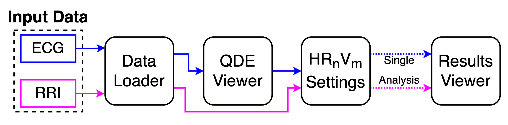

# Summary

Variation of the time interval between a consistent point in time of each heartbeat (generally related to ventricular electrical activation), known as heart rate variability (HRV) [@RN28], has been proven by numerous studies to be a useful indicator of physiological status [@RN69; @RN28]. Thanks to its non-invasive nature and strong connection to the autonomic nervous system (ANS) [@RN69; @RN28], HRV has been adopted to study a wide range of diseases and clinical conditions, which include myocardial infarction [@RN83], sudden cardiac death [@RN84], diabetes [@RN86], renal failure [@RN87], sepsis [@RN88], seizure [@RN97], and cancer [@RN90]. In addition, the emergence of wearable devices with heart monitoring capabilities has also allowed researchers to study the above-mentioned medical conditions in real-world settings [@RN91], as well as in non-clinical applications such as sports [@RN51], stress [@RN93], and sleep monitoring [@RN94].

A variety of HRV metrics can be derived from the heartbeat time sequence known as the inter-beat interval (IBI), or the R-to-R peak interval (RR interval or RRI). Such sequences are often extracted from biomedical signals such as electrocardiograms (ECG) and photoplethysmograms (PPG). It is believed that a decrease of complexity in HRV is associated with an increase in both morbidity and mortality [@RN69; @RN28]. To qualify and quantify the complexity, various conventional HRV metrics in linear and nonlinear domains [@RN23] have been established to reflect the dynamic of HRV [@RN28; @RN8]. However, the exact mechanism regulating HRV is not perfectly clear in every detail [@RN69; @RN28]. Some of recent developments in HRV have been mainly focused on nonlinear metrics such as variants of approximate entropy (ApEn) and sample entropy (SampEn) [@RN95; @RN96; @RN82; @Liu:2013].

Despite progress in HRV metrics research, the representation of RRI upon which HRV is based has rarely been examined. @RN62 proposed a binary symbolization of RRI, which combined with ApEn provides new information about the normal heart period regularity. The multiscale entropy (MSE) metrics [@RN70] calculate SampEn on multiscale coarse-gained series derived from RRI to reflect the nonlinear behavior of the heart on multiple time scales. To generalize the averaging multiscale approach, @Liu:2020 proposed heart rate n-variability (HRnV) that utilizes sliding and stridden summation windows over RRI to obtain new RRI-like intervals denoted as $RR_{n}I$ and $RR_{n}I_{m}$. Using these novel RRI representations, new HRnV metrics can be calculated with conventional HRV analysis metrics, providing an entire family of new metrics, and potentially additional insights into the dynamics and long-term dependencies of the original RRI, making HRnV complementary to the conventional HRV analysis. Research has shown that HRnV improves the accuracy of triage for patients with chest pain [@Liu:2020] and sepsis [@Liu:2021]. However, full potentials and physiological meaning of HRnV require broader collaboration between researchers and clinicians in various settings and applications. As such, an open and standard software package for HRnV analysis is essential to facilitate further research on HRnV and its possible variations.

# Statement of need

There is an abundance of HRV software tools for commercial and non-commercial use, including Kubios HRV [@RN3], ECGlab [@RN66], ARTiiFACT [@RN65], RHRV [@RN64], and RR-APET [@RN72]. However, none of them is suitable for incorporating HRnV analysis. Moreover, these tools provide inconsistent results, making comparisons between research impossible [@RN4]. Since HRnV shares some common processing methods with conventional HRV analysis, it is natural to develop the HRnV package based on existing benchmarked software. We therefore developed an open-source HRnV software, HRnV-Calc, based on the PhysioNet Cardiovascular Signal Toolbox (PCST) [@RN4]. Compared to other HRV freeware, the PCST is standardized and well-documented. More importantly, the PCST is an open-source HRV software suite which has gone through rigorous testing and benchmarking in both technical and clinical settings. Based on the fully functional HRV command-line code provided by the PCST, HRnV-Calc has integrated graphical user interfaces (GUIs) that enable manual inspection and correction of RRI extraction from ECG signals, flexible configuration, and batch-processing, in a step-by-step manner. Its inherent functions support the analysis of both HRnV and conventional HRV metrics with enhanced usability. Therefore, HRnV-Calc not only facilitates new methodological developments, but also provide clinicians and researchers with transparent and easily accessible HRnV and HRV analyses.

# Basic Usage
This section provides a non-exhaustive walkthrough of the features and functionalities offered by HRnV-Calc. 

The HRnV method for alternative RRI representation is a unique and the main feature implemented in HRnV-Calc. HRnV utilizes sliding and stridden summation windows on the original RRI, resulting in new $RR_{n}I$ and $RR_{n}I_{m}$  intervals ($n$ and $m$ are parameters for HRnV), which can then be fed into conventional HRV analysis to calculate corresponding $HR_{n}V$ and $HR_{n}V_{m}$  metrics. For clarification, the term ‘HRnV’ refers to the name of the method (i.e., heart rate n-variability), while $HR_{n}V$ and $HR_{n}V_{m}$ refer to the derived metrics based on $RR_{n}I$ and $RR_{n}I_{m}$ intervals, respectively.

HRnV-Calc is primarily operated using its step-by-step GUIs, which include four main interfaces: (1) Data Loader, (2) QRS Detection & Edits (QDE) viewer, (3) $HR_{n}V_{m}$ 
Setting viewer, and (4) $HR_{n}V_{m}$ Results Display. A typical workflow using HRnV-Calc is illustrated in \autoref{fig:workflow}.

The initial GUI of HRnV-Calc is Data Loader, which provides basic settings for users to begin HRV/HRnV analyses. Users may choose to perform analysis on a single file or multiple files as batch-processing. Currently, HRnV-Calc supports ECG and RRI inputs in the format of free text and CSV.

Since the QRS peak detection of ECG is crucial for subsequent HRnV and HRV analysis, especially in clinical settings, the QDE viewer is designed to configure and inspect QRS detection on ECG inputs interactively.

The $HR_{n}V_{m}$ Setting viewer  is used to configure HRnV and HRV analyses. Users may specify the $n$ and $m$ parameters for HRnV analysis and other configurations to process the input signal.

Once the HRnV or HRV analysis is configured, HRnV-Calc will automatically save all analysis results under the user-specified directory in the Excel spread sheet format. In addition, HRnV-Calc will also display the results of a single $HR_{n}V_{m}$ analysis for rapid examination of the analysis results.

# References